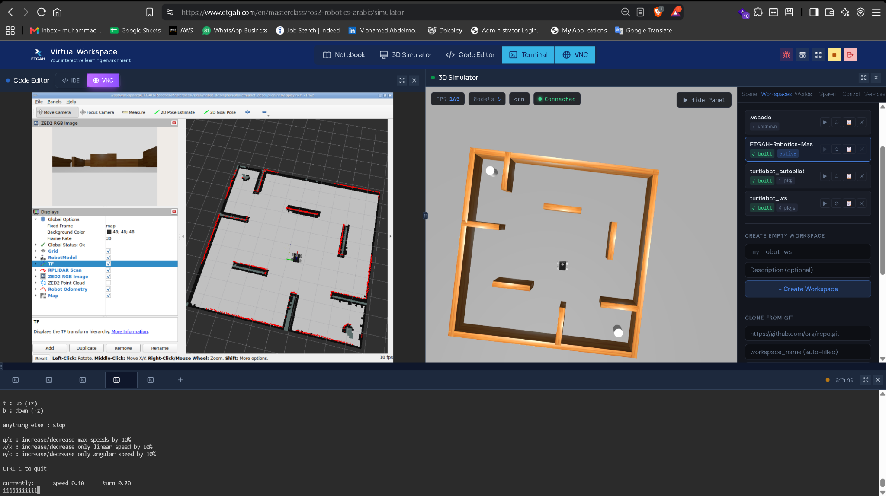
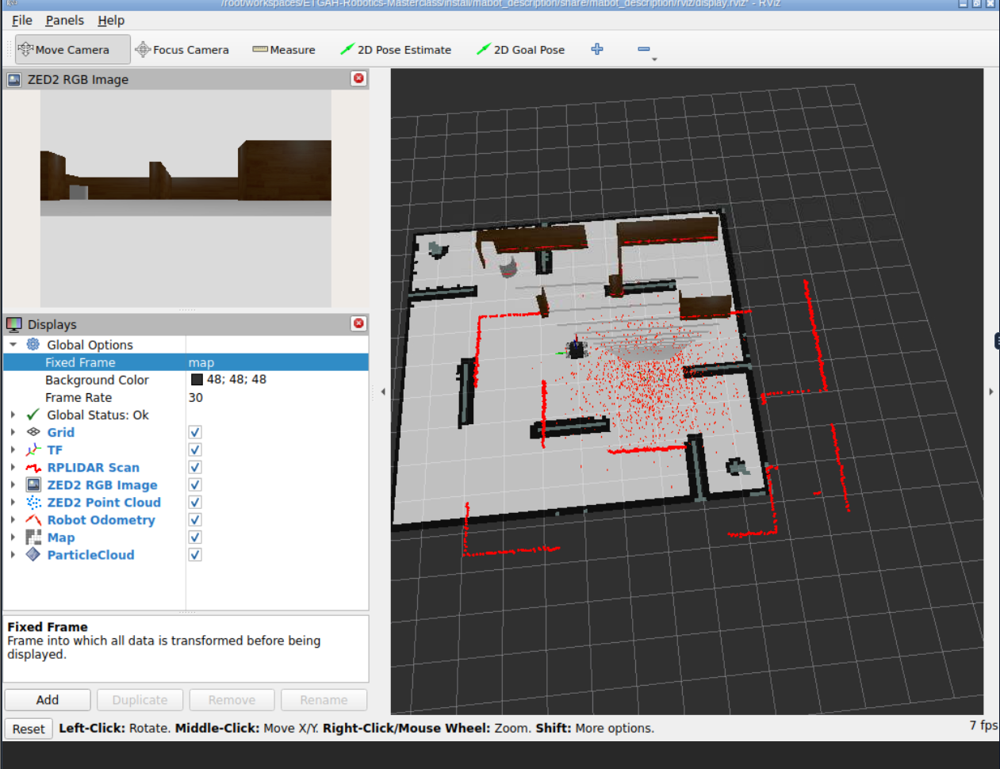
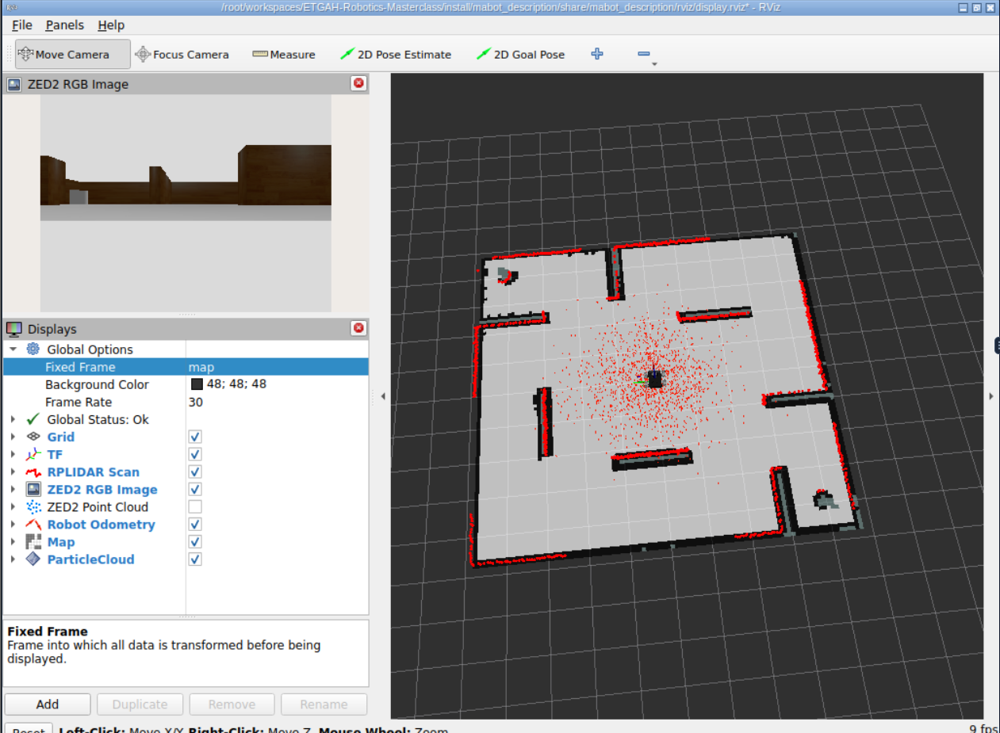
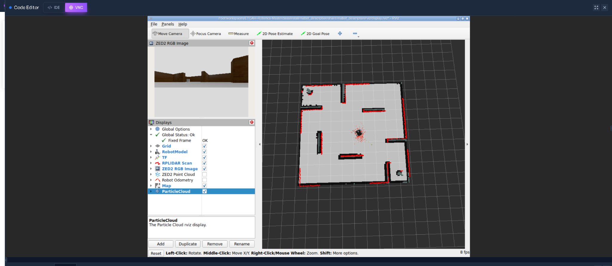
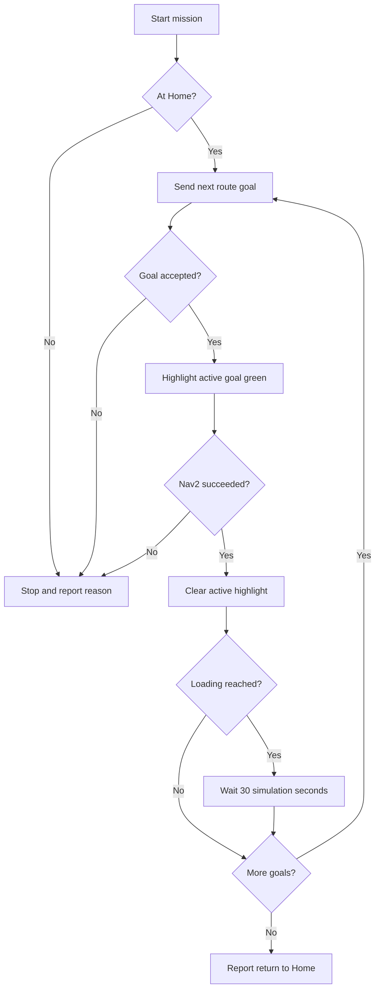
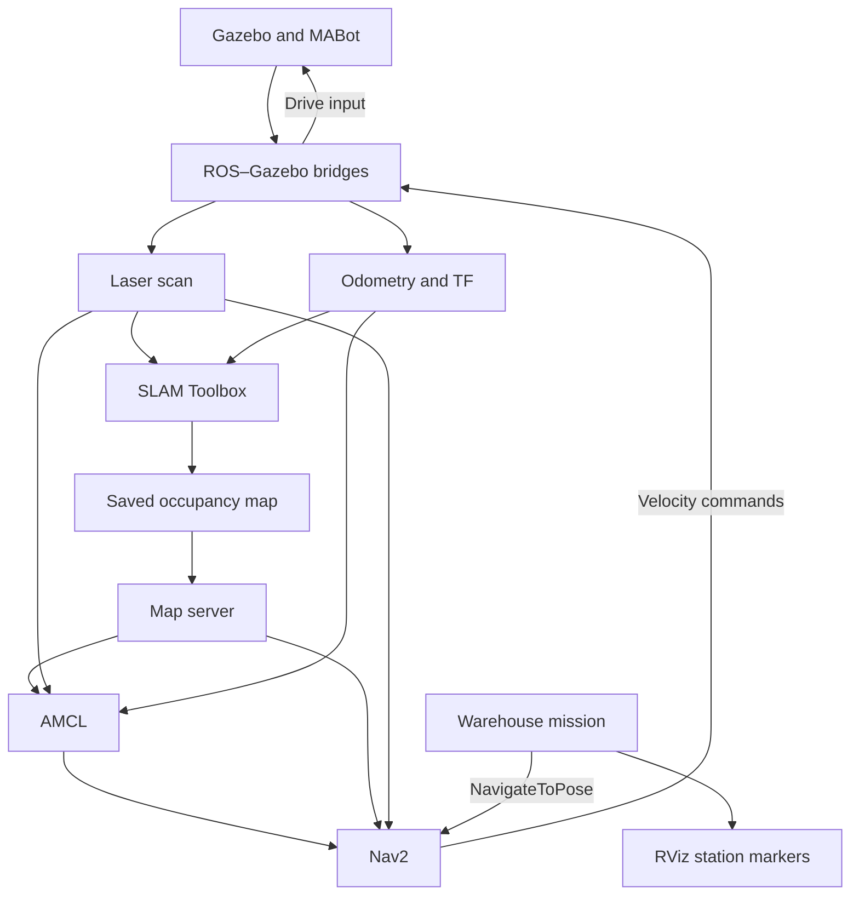

<p align="center">
  <a href="https://www.etgah.com/en">
    
  </a>
</p>

<h1 align="center">ETGAH Robotics Masterclass</h1>
<h2 align="center">MABot — From CAD to Autonomous Warehouse Navigation</h2>

<p align="center">
  A custom four-wheel robot, five connected ROS 2 packages, and a complete warehouse delivery workflow.<br>
  Designed and integrated by <strong>Mohamed Abdelmoniem</strong>.
</p>

<p align="center">
  
  
  
  
  
</p>

<p align="center">
  <a href="#project-overview">Overview</a> ·
  <a href="#package-guide">Packages</a> ·
  <a href="#run-the-warehouse-demo">Run the demo</a> ·
  <a href="#rviz-operator-guide">RViz guide</a> ·
  <a href="#masterclass-tasks">Course tasks</a>
</p>

<p align="center">
  
  <br>
  <em>MABot's actual robot model: custom chassis, four treaded wheels, front camera, and roof-mounted LiDAR.</em>
</p>

---

## Project overview

This repository documents my work in the [ETGAH ROS 2 Robotics Masterclass](https://www.etgah.com/en/masterclass/ros2-robotics-arabic), from Python and ROS 2 communication exercises to an integrated autonomous mobile robot.

**MABot** connects mechanical design, robot description, simulation, perception, mapping, localization, and navigation. I designed and assembled the robot in Autodesk Fusion 360, exported its model to URDF/Xacro, integrated it with Gazebo Harmonic, and developed the ROS 2 workflow around it.

The final warehouse mission starts at the Charging Station, visits the Loading Station, waits for 30 simulation seconds, continues to Storage and Shipping, and returns Home. Each navigation result is checked before the next goal is sent, and RViz highlights the active destination.

| Platform | Perception | Mission |
| :--- | :--- | :--- |
| Custom four-wheel skid-steer robot | Simulated RPLIDAR S2 and ZED 2 RGB-D sensing | Four named locations and four navigation legs |
| Fusion 360, URDF/Xacro, TF2, Gazebo | Laser scans, RGB images, depth, and point clouds | Home check, sequential goals, Loading wait, and failure reporting |

MABot is used with the course team's approval as the custom robot platform for the warehouse assignment. This project demonstrates simulation-based delivery navigation; the named Charging Station is a waypoint, not an implemented charging or docking system.

### Explore the project

- [Package guide](#package-guide): the purpose, inputs, outputs, and visual results of all five MABot packages.
- [System architecture](#system-architecture): how sensing, localization, Nav2, and mission control connect.
- [Build and environment](#build-and-environment): prepare the workspace.
- [Warehouse demo](#run-the-warehouse-demo): start simulation, localize, navigate, and run the mission.
- [RViz operator guide](#rviz-operator-guide): displays, topics, tools, and marker colors.
- [Mapping workflow](#create-and-save-a-map): create a new map and choose the correct localization mode.
- [Troubleshooting](#troubleshooting): resolve common setup and mission problems.

## Package guide

| Stage | Package | Main responsibility | Detailed guide |
| :--- | :--- | :--- | :--- |
| 01 · Model & simulate | [`mabot_description`](./mabot_description/) | Robot geometry, TF, drive system, simulated sensors, and bridges | [README](./mabot_description/README.md) |
| 02 · Build a map | [`mabot_slam`](./mabot_slam/) | SLAM Toolbox mapping, map saving, and pose-graph localization | [README](./mabot_slam/README.md) |
| 03 · Estimate pose | [`mabot_localization`](./mabot_localization/) | Standalone AMCL localization on a saved occupancy map | [README](./mabot_localization/README.md) |
| 04 · Navigate | [`mabot_navigation`](./mabot_navigation/) | AMCL, Nav2 servers, costmaps, planning, control, and behaviors | [README](./mabot_navigation/README.md) |
| 05 · Execute a mission | [`mabot_warehouse_waypoints`](./mabot_warehouse_waypoints/) | Pose recording, named delivery goals, result handling, and markers | [README](./mabot_warehouse_waypoints/README.md) |

### 01 · Robot modeling and simulation

**Package: [`mabot_description`](./mabot_description/README.md)**

This package provides MABot's physical and kinematic model. The Fusion 360 assembly becomes a reusable Xacro description with visual meshes, collision geometry, inertial properties, four continuous wheel joints, and fixed sensor mounts.

Gazebo's differential-drive system controls the wheel pairs on each side. The robot state publisher connects the chassis, wheels, LiDAR, and camera frames; ROS–Gazebo bridges expose the simulated measurements and commands to ROS 2.

<p align="center">
  
  <br>
  <em>Mechanical assembly in Fusion 360 before export to ROS 2.</em>
</p>

| Part of the package | What it provides |
| :--- | :--- |
| `urdf/` and `meshes/` | Modular robot description and exported component geometry |
| `urdf/mabot.gazebo.xacro` | Drive system, joint state publishing, and simulated sensors |
| `config/gz_bridge.yaml` | ROS–Gazebo topic connections |
| `launch/gazebo.launch.py` | MABot in its original custom world |
| `launch/warehouse.launch.py` | MABot in the ETGAH warehouse world |
| `launch/display.launch.py` | Robot visualization in RViz |

The sensor integration includes `/scan`, `/camera/image_raw`, and `/camera/points`. Camera measurements use a dedicated optical frame, keeping sensor coordinates separate from the CAD mesh orientation.

<details>
<summary><strong>View the URDF model and TF evidence</strong></summary>

<p align="center">
  
  <br>
  <em>The assembled URDF model in the VS Code visualizer.</em>
</p>

<p align="center">
  
</p>

[Open the full TF tree PDF](./mabot_description/images/frames_2026-09-04_07.41.24.pdf).

The description package also contains an independent LiDAR obstacle-avoidance controller. Use it separately from Nav2 so multiple controllers do not compete to publish velocity commands.

</details>

### 02 · SLAM mapping and pose-graph localization

**Package: [`mabot_slam`](./mabot_slam/README.md)**

SLAM Toolbox combines laser scans with the robot's odometry and transforms to build a 2D occupancy map. MABot is driven through the environment using keyboard teleoperation while the map develops in RViz.

<p align="center">
  
  <br>
  <em>Mapping result in the original MABot world. The same mapping workflow is used for the warehouse.</em>
</p>

The package supports two different saved outputs:

| Saved output | Files | Used by |
| :--- | :--- | :--- |
| Occupancy grid | `.yaml` + `.pgm` | Map server, AMCL, and Nav2 |
| Serialized pose graph | `.posegraph` + `.data` | SLAM Toolbox's graph-based localization workflow |

An occupancy image does not replace a serialized pose graph. Use the correct files for the localization method you launch.

The repository contains maps for both the original robot world and the warehouse. A map and its waypoint coordinates must describe the same environment and coordinate frame.

**Key launches:** `mapping.launch.py` creates the map; `localization.launch.py` loads a saved graph using its `posegraph_file` argument.

### 03 · AMCL localization

**Package: [`mabot_localization`](./mabot_localization/README.md)**

AMCL estimates the robot's pose inside a known map. The map server loads the saved occupancy grid, and AMCL uses LiDAR observations and odometry to maintain a particle distribution over possible robot poses.

The operator supplies an initial estimate in RViz. Correct localization is checked through scan alignment, particle concentration, and stable tracking as the robot moves.

<table>
  <tr>
    <td align="center" width="50%"><strong>Before pose correction</strong></td>
    <td align="center" width="50%"><strong>After pose correction</strong></td>
  </tr>
  <tr>
    <td></td>
    <td></td>
  </tr>
</table>

<p align="center"><em>Initial-pose validation in the original MABot world.</em></p>

| Responsibility | Implementation |
| :--- | :--- |
| Load a known environment | Nav2 map server |
| Estimate pose | AMCL particle filter |
| Activate localization nodes | Localization lifecycle manager |
| Initialize the estimate | RViz 2D Pose Estimate on `/initialpose` |
| Connect global and local frames | AMCL publishes `map → odom` |

<details>
<summary><strong>View particle convergence and the AMCL animation</strong></summary>

<p align="center">
  
  <br>
  <em>Particle distribution and scan alignment after localization.</em>
</p>

<p align="center">
  
</p>

</details>

Use this package for standalone localization experiments. The full navigation launch below starts its own map server and AMCL instance, so the standalone launch should be stopped when switching to Nav2.

### 04 · Autonomous navigation with Nav2

**Package: [`mabot_navigation`](./mabot_navigation/README.md)**

This package turns a localized robot into a goal-driven robot. The BT Navigator coordinates global planning, local motion control, and recovery behaviors. Costmaps combine the saved map and live laser observations with obstacle inflation and MABot's footprint.

<p align="center">
  
  <br>
  <em>Recorded Nav2 demonstration in the original MABot world: localization, path planning, and robot motion.</em>
</p>

| Component | Role | Configuration |
| :--- | :--- | :--- |
| AMCL | Localize the robot on the saved map | `config/amcl.yaml` |
| NavFn planner | Compute the global path | `config/planner_server.yaml` |
| DWB controller | Evaluate local trajectories and generate motion commands | `config/controller_server.yaml` |
| Behavior server | Provide spin, backup, and wait behaviors | `config/behavior_server.yaml` |
| BT Navigator | Coordinate navigation actions and behaviors | `config/bt_navigator.yaml` |
| Lifecycle managers | Configure and activate localization/navigation nodes | `launch/nav2_bringup.launch.py` |

The launch accepts an explicit `map` YAML path and starts neither Gazebo nor RViz. It can be used with either project world when the matching map is selected.

**Before automation:** send one manual navigation goal and confirm the robot reaches it. Selecting a pose in RViz alone is not confirmation of a successful Nav2 result.

### 05 · Autonomous warehouse waypoint delivery

**Package: [`mabot_warehouse_waypoints`](./mabot_warehouse_waypoints/README.md)**

This package adds a warehouse mission above Nav2. It records named locations, checks the robot's starting pose, sends one navigation action at a time, and presents the mission state through RViz markers and terminal messages.

| Executable | Purpose |
| :--- | :--- |
| `waypoint_recorder` | Record `PoseStamped` messages from `/waypoint_pose` into YAML. |
| `waypoint_runner` | Execute an arbitrary list in YAML order, including each entry's wait. |
| `warehouse_mission` | Run the named delivery sequence and publish station markers. |

#### Mission contract

| Stage | Destination / action | Condition to continue |
| :--- | :--- | :--- |
| Start | Robot localized at Home | Position and heading pass the Home check |
| Leg 1 | Loading Station | Nav2 reports success |
| Loading | Wait 30 simulation seconds | Simulation-clock interval has elapsed |
| Leg 2 | Storage Area | Nav2 reports success |
| Leg 3 | Shipping Station | Nav2 reports success |
| Leg 4 | Return to Home | Nav2 reports success; report completion |

The implemented Home tolerance is **0.30 m** in position and **0.35 rad** in heading. Rejected or unsuccessful navigation goals stop the route and report the affected station. The next goal is not sent until the current goal succeeds.



**RViz marker behavior:** four station arrows and four name labels are published in one `MarkerArray`. An accepted navigation goal is green; all other stations are blue. During the Loading wait and after mission completion, all stations are blue because no navigation goal is active. The node stays alive after success to keep publishing markers.

The warehouse mission uses a fixed route and a fixed Loading wait. The generic runner's YAML order and per-entry wait settings are a separate execution mode.

<!-- Add the narrated warehouse demonstration URL and a real warehouse marker capture here when available. Keep these separate from the original-world Nav2 demo above. -->

## System architecture



Mapping and AMCL localization are separate operating phases. During saved-map navigation, AMCL supplies `map → odom`, the simulation supplies `odom → base_footprint`, and the robot description supplies the transforms to the physical links and sensors.

| Interface | Type / purpose | Main consumer |
| :--- | :--- | :--- |
| `/scan` | `sensor_msgs/msg/LaserScan` | SLAM, AMCL, costmaps |
| `/odom` | `nav_msgs/msg/Odometry` | Localization and navigation |
| `/tf`, `/tf_static` | Transform tree | RViz, localization, navigation |
| `/map` | `nav_msgs/msg/OccupancyGrid` | AMCL, costmaps, RViz |
| `/cmd_vel` | `geometry_msgs/msg/Twist` in this configuration | Robot drive bridge |
| `/waypoint_pose` | `geometry_msgs/msg/PoseStamped` | Waypoint recorder |
| `/navigate_to_pose` | `nav2_msgs/action/NavigateToPose` | Nav2 action server |
| `/warehouse_waypoints/markers` | `visualization_msgs/msg/MarkerArray` | RViz |
| `/clock` | Simulation time | Nodes using `use_sim_time` |

## Build and environment

Developed and demonstrated in the **ETGAH Virtual Workspace**, using **ROS 2 Jazzy**, **Gazebo Harmonic**, **RViz 2**, and Python ROS 2 nodes. The robot's mechanical design was created in **Autodesk Fusion 360**.

### Obtain the repository

For a fresh workspace:

```bash
mkdir -p ~/workspaces
cd ~/workspaces
git clone https://github.com/men3m-4/ETGAH-Robotics-Masterclass.git
cd ETGAH-Robotics-Masterclass
```

For an existing checkout, use that workspace rather than cloning a second copy.

### Resolve dependencies and build the MABot packages

With ROS 2 Jazzy, Gazebo integration, `colcon`, and `rosdep` available:

```bash
source /opt/ros/jazzy/setup.bash
cd ~/workspaces/ETGAH-Robotics-Masterclass

rosdep install --from-paths \
  mabot_description mabot_slam mabot_localization \
  mabot_navigation mabot_warehouse_waypoints warehouse_world \
  --ignore-src -r -y

colcon build --symlink-install --packages-select \
  warehouse_world mabot_description mabot_slam \
  mabot_localization mabot_navigation mabot_warehouse_waypoints

source install/setup.bash
```

The packages live directly under the repository root; this workspace does not require moving them into a new `src/` directory.

**In every new terminal**, run:

```bash
source /opt/ros/jazzy/setup.bash
cd ~/workspaces/ETGAH-Robotics-Masterclass
source install/setup.bash
```

## Run the warehouse demo

### 1. Choose the world and matching map

| Environment | Simulation launch | Saved occupancy map |
| :--- | :--- | :--- |
| Original MABot world | `mabot_description gazebo.launch.py` | `mabot_localization/map/mabot_world_map.yaml` |
| Warehouse delivery | `mabot_description warehouse.launch.py` | `mabot_slam/map/mabot_warehouse_map.yaml` |

The commands below use the **warehouse**. The earlier SLAM, AMCL, and Nav2 screenshots show the original world and are labeled accordingly.

### 2. Start the simulator — Terminal 1

```bash
ros2 launch mabot_description warehouse.launch.py
```

Use the ETGAH 3D Simulator for the graphical view. On a local desktop, add `use_gazebo_gui:=true`. Start only one simulator instance for the session.

### 3. Start localization and navigation — Terminal 2

```bash
ros2 launch mabot_navigation nav2_bringup.launch.py \
  map:="$PWD/mabot_slam/map/mabot_warehouse_map.yaml"
```

Stop any standalone SLAM or AMCL launch first. This command already starts the map server and AMCL alongside Nav2. Keep the simulation and its bridges running.

### 4. Open RViz — Terminal 3

```bash
ros2 run rviz2 rviz2 \
  -d "$PWD/mabot_navigation/rviz/navigation.rviz" \
  --ros-args -p use_sim_time:=true
```

Set **Fixed Frame** to `map`, initialize AMCL with **2D Pose Estimate**, and verify that the live scan matches the walls. Test one manual goal before running automation.

### 5. Move the robot to Home

The mission begins at Home; it does not automatically drive there before the start check. Use a manual navigation goal if necessary and wait for success.

For the committed warehouse waypoint configuration:

```bash
ros2 action send_goal /navigate_to_pose nav2_msgs/action/NavigateToPose \
  "{pose: {header: {frame_id: map}, pose: {position: {x: 5.7776, y: -0.2179, z: 0.0}, orientation: {x: 0.0, y: 0.0, z: -0.72773, w: 0.68587}}}}" \
  --feedback
```

If you replace the waypoint file, use the new Home pose. An initial-pose estimate changes localization; it does not move the robot to the selected location.

### 6. Display markers and start the mission — Terminal 4

In RViz, add **MarkerArray** and select `/warehouse_waypoints/markers`. Then run:

```bash
ros2 run mabot_warehouse_waypoints warehouse_mission \
  --ros-args \
  -p use_sim_time:=true \
  -p waypoints_file:="$PWD/mabot_warehouse_waypoints/config/warehouse_waypoints.yaml"
```

Expected successful log sequence, with timestamps omitted:

```text
Waiting for Nav2 /navigate_to_pose...
Checking map -> base_footprint at Home...
Home check passed.
[1/4] Going to Loading
Reached Loading.
Loading: waiting 30 simulation seconds.
Loading wait complete.
[2/4] Going to Storage
Reached Storage.
[3/4] Going to Shipping
Reached Shipping.
[4/4] Going to Home
Reached Home.
Mission completed: returned to Home.
Markers remain visible. Press Ctrl+C to close.
```

The 30-second wait follows `/clock`: pausing the simulator pauses the wait. Stop teleoperation and independent autopilot nodes during the mission. Ctrl+C requests cancellation of an outstanding navigation goal; inspect the reported result.

## RViz operator guide

### Displays to enable

| Display | Topic / setting | What it shows |
| :--- | :--- | :--- |
| Map | `/map`; Reliable / Transient Local | Saved occupancy grid |
| RobotModel | `/robot_description` | MABot geometry |
| TF | Frame tree | Robot and sensor frame connections |
| LaserScan | `/scan`; Best Effort if required by the publisher | Live LiDAR observations |
| ParticleCloud | `/particle_cloud`; Nav2 RViz plugin | AMCL pose hypotheses |
| Map: Global Costmap | `/global_costmap/costmap`; Color Scheme `costmap` | Global obstacle costs |
| Map: Local Costmap | `/local_costmap/costmap`; Color Scheme `costmap` | Nearby obstacle costs |
| Path: Global Plan | `/plan` | Planned route |
| Path: Local Plan | `/local_plan`, when published | Controller trajectory |
| MarkerArray | `/warehouse_waypoints/markers`; Reliable / Transient Local | Station names and active goal |
| Image, optional | `/camera/image_raw` | RGB camera view |
| PointCloud2, optional | `/camera/points` | Depth-derived point cloud |

Use moderate costmap transparency so walls and paths remain readable. The waypoint publisher supplies marker colors automatically. Save the setup through **File → Save Config As** to `mabot_navigation/rviz/navigation.rviz`.

### Three tools with different jobs

| Operator action | RViz tool / interface | Result |
| :--- | :--- | :--- |
| Initialize localization | **2D Pose Estimate** on `/initialpose` | Supplies the robot's estimated current position and heading |
| Drive to a destination | Navigation goal tool; `/goal_pose` or Nav2 action integration | Requests navigation |
| Record a destination | **2D Goal Pose** (`rviz_default_plugins/SetGoal`) on `/waypoint_pose` | Stores a pose while the recorder is running |

For pose selection, click to set the position and drag to set the heading. A recording click saves the selected map pose; it neither drives the robot nor measures the robot's current position.

If SetGoal is already installed in the toolbar, change its topic through **Panels → Tool Properties** instead of adding it again. Restore `/goal_pose` when switching back to manual navigation with that tool.

### Record a new set of stations

Stop the mission and any running recorder. To keep the existing configuration intact, record to a fresh filename:

```bash
new_waypoints="$PWD/mabot_warehouse_waypoints/config/warehouse_waypoints_$(date +%Y%m%d_%H%M%S).yaml"

ros2 run mabot_warehouse_waypoints waypoint_recorder \
  --ros-args \
  -p use_sim_time:=true \
  -p output_file:="$new_waypoints" \
  -p wait_seconds:=0.0
```

1. Set RViz **Fixed Frame** to `map`.
2. Set the SetGoal tool's **Topic** to `/waypoint_pose`.
3. Select four poses: Home, Loading, Storage, and Shipping.
4. Stop the recorder with Ctrl+C before editing the file.
5. Rename the generated entries to exactly `Home`, `Loading`, `Storage`, and `Shipping`.
6. Set Loading's `wait_seconds` to `30.0`, and the other entries to `0.0`.
7. Pass the new file's full path as `waypoints_file` when launching the mission.

The mission requires exactly those four names, with matching capitalization. Reusing a nonempty recording file appends more stations; selecting a pose twice creates two entries.

### Committed warehouse poses

Coordinates are in the saved warehouse map frame, with positions in meters and yaw in radians.

| Name | X | Y | Yaw | Recorded wait |
| :--- | ---: | ---: | ---: | ---: |
| Home | 5.7776 | -0.2179 | -1.6300 | 0 s |
| Loading | 5.7805 | -1.4697 | -1.5970 | 30 s |
| Storage | 1.7152 | -1.2704 | 2.8764 | 0 s |
| Shipping | 0.0220 | 0.1107 | -0.0407 | 0 s |

[Open the waypoint YAML](./mabot_warehouse_waypoints/config/warehouse_waypoints.yaml). Recheck poses after remapping; Gazebo world coordinates and map coordinates are not automatically interchangeable.

## Create and save a map

Use this workflow when building a new map instead of using the committed map. Keep the selected world running and stop standalone localization and Nav2 while mapping.

<details>
<summary><strong>Mapping, teleoperation, and occupancy-grid saving commands</strong></summary>

Start SLAM Toolbox:

```bash
ros2 launch mabot_slam mapping.launch.py
```

In another prepared terminal, drive slowly through accessible aisles:

```bash
ros2 run teleop_twist_keyboard teleop_twist_keyboard \
  --ros-args -p speed:=0.10 -p turn:=0.20
```

Use `i` for forward, `,` for backward, `j` and `l` to turn, and `k` to stop. Keep focus in the teleoperation terminal. Explore corners and gaps, revisit known areas, and inspect scan alignment in RViz.

Save with a new prefix to preserve existing maps:

```bash
mkdir -p mabot_slam/map
map_prefix="$PWD/mabot_slam/map/warehouse_$(date +%Y%m%d_%H%M%S)"

ros2 run nav2_map_server map_saver_cli \
  -f "$map_prefix" --fmt pgm \
  --ros-args -p use_sim_time:=true -p save_map_timeout:=20.0
```

Keep both the `.yaml` and `.pgm` files. Stop mapping before starting AMCL/Nav2, then pass the new YAML to the navigation launch using `map:=/absolute/path/to/the/map.yaml`.

</details>

### Choose the localization mode

| Mode | Input | Launch | Typical use |
| :--- | :--- | :--- | :--- |
| SLAM Toolbox localization | `.posegraph` + `.data` prefix | `mabot_slam localization.launch.py` | Reuse the serialized SLAM environment |
| Standalone AMCL | Map `.yaml` + image | `mabot_localization amcl.launch.py` | Inspect localization and particle behavior |
| Nav2 with AMCL | Map `.yaml` + image | `mabot_navigation nav2_bringup.launch.py` | Navigate and execute warehouse goals |

Run one localization mode at a time to keep a single publisher responsible for `map → odom`.

<details>
<summary><strong>Pose-graph saving and standalone localization commands</strong></summary>

To save a graph, keep SLAM mapping running and serialize the same mapping session:

```bash
mkdir -p mabot_slam/posegraph
graph_prefix="$PWD/mabot_slam/posegraph/warehouse_$(date +%Y%m%d_%H%M%S)"

ros2 service call /slam_toolbox/serialize_map \
  slam_toolbox/srv/SerializePoseGraph \
  "{filename: '$graph_prefix'}"
```

After stopping mapping, load the graph using its prefix without a file extension:

```bash
ros2 launch mabot_slam localization.launch.py \
  posegraph_file:="$graph_prefix"
```

The variable above belongs to the terminal in which it was set. In a different terminal, supply the actual full prefix.

Alternatively, test warehouse localization with standalone AMCL:

```bash
ros2 launch mabot_localization amcl.launch.py \
  map:="$PWD/mabot_slam/map/mabot_warehouse_map.yaml" \
  use_sim_time:=true
```

Select the robot's actual starting pose in RViz, check scan alignment and particle convergence, and verify localization remains stable while moving. Stop this launch before starting the full Nav2 launch.

</details>

## Troubleshooting

| Symptom | What to check |
| :--- | :--- |
| Package or executable not found | Build the relevant package and source this workspace in the current terminal. |
| Map missing in RViz | Check the map YAML path, referenced image, active map server, and Map display QoS. |
| Scan does not align with walls | Check the world/map pair, initial pose, TF, and simulation time. |
| TF jumps between poses | Stop duplicate SLAM/AMCL instances publishing `map → odom`. |
| Robot moves while recording points | Use SetGoal on `/waypoint_pose`, not a navigation goal interface. |
| Recorder receives nothing | Check its output path, `/waypoint_pose`, and RViz Fixed Frame `map`. |
| `Robot is not at Home` | Navigate physically to Home, wait for success, and check localization. |
| No green station | A goal becomes green after Nav2 accepts it; the recorder alone does not publish mission markers. |
| Loading wait appears too long | It is 30 simulation seconds; inspect `/clock` and whether Gazebo is paused or running slowly. |
| Goal fails | Inspect the reported station, Nav2 errors, localization, obstacle clearance, and footprint before restarting. |

<details>
<summary><strong>Useful runtime checks</strong></summary>

```bash
ros2 pkg executables mabot_warehouse_waypoints
ros2 topic list -t
ros2 action info /navigate_to_pose
ros2 topic type /cmd_vel
ros2 topic info /warehouse_waypoints/markers --verbose
```

Check the transform separately; stop the streaming command with Ctrl+C:

```bash
ros2 run tf2_ros tf2_echo map base_footprint
```

Check node activation:

```bash
for node in map_server amcl planner_server controller_server behavior_server bt_navigator; do
  ros2 lifecycle get "/$node"
done
```

</details>

## Demonstration guide

The media above follows the project's development stages: mechanical assembly, URDF visualization, mapping, localization, and Nav2 navigation. The GIFs are recordings already stored in this repository; the larger animations may take time to load.

For the narrated warehouse demonstration, show:

1. MABot and its sensors inside the warehouse.
2. Mapping and the saved occupancy map files.
3. AMCL initialization, particle behavior, and laser-map alignment.
4. A manual navigation goal with costmaps and paths visible.
5. Four station names, the starting Home pose, and green active-goal changes.
6. Arrival at Loading, the full 30-second simulation wait, Storage, Shipping, and the return Home.
7. The final mission-completion message.

Record failure handling as a separate test if it is included in the demonstration. Clearly identify any playback speed changes during the timed wait.

## Masterclass tasks

The earlier exercises build the programming and ROS 2 communication foundations used by the MABot project.

| # | Task | Focus | Guide |
| ---: | :--- | :--- | :--- |
| 1 | Programming for Robotics | Python, object-oriented programming, and a distance-sensor mini project | [robot-distance-sensor-ma](./robot-distance-sensor-ma/README.md) |
| 2 | Linux Essentials & ROS 2 Fundamentals | Linux workflow, nodes, topics, and TurtleBot control | [turtlebot-controller-ma](./turtlebot-controller-ma/README.md) |
| 3 | ROS 2 Services | Custom service interfaces and obstacle avoidance with manual override | [turtlebot_operation_ma](./turtlebot_operation_ma/README.md) |
| 4 | ROS 2 Actions | Custom action interfaces and a TurtleBot delivery mission | [turtlebot_delivery_ma](./turtlebot_delivery_ma/README.md) |
| 5 | Robot Modeling, TF2 & Gazebo | CAD, URDF/Xacro, transforms, robot simulation, and sensors | [mabot_description](./mabot_description/README.md) |
| 6 | SLAM Toolbox | Map creation, occupancy-grid saving, and pose-graph localization | [mabot_slam](./mabot_slam/README.md) |
| 7 | AMCL Localization | Saved-map localization, initial pose, and particle convergence | [mabot_localization](./mabot_localization/README.md) |
| 8 | Nav2 Navigation | Planning, control, behaviors, costmaps, and manual goal navigation | [mabot_navigation](./mabot_navigation/README.md) |
| 9 | Warehouse Waypoint Delivery | Named locations, result-driven sequencing, Loading wait, and RViz markers | [mabot_warehouse_waypoints](./mabot_warehouse_waypoints/README.md) |

## Learning documentation

I maintain a [ROS 2 Robotics Masterclass Notion knowledge base](https://app.notion.com/p/ROS2-Robotics-Masterclass-3c2631df44df801e9c71f403775f619f?source=copy_link) alongside the code, with concise notes, ROS 2 commands, workflow summaries, and troubleshooting observations.

## Credits and project resources

- **Robot design and ROS 2 integration:** [Mohamed Abdelmoniem](https://github.com/men3m-4).
- **Course and development environment:** [ETGAH Robotics Masterclass](https://www.etgah.com/en/masterclass/ros2-robotics-arabic).
- **Warehouse environment:** [ETGAH warehouse_world](https://github.com/ETGAH/warehouse_world); the project includes a [local package copy](./warehouse_world/).
- **Robot CAD sources and asset credits:** see [mabot_description](./mabot_description/README.md#cad-models-and-external-assets) for the wheel, LiDAR, and camera references.
- **Package licensing:** consult each package's manifest and license files; third-party CAD and environment assets retain their respective terms.

<p align="center">
  <strong>Designed, simulated, mapped, localized, and navigated with MABot.</strong><br>
  <a href="#etgah-robotics-masterclass">Back to top</a>
</p>
