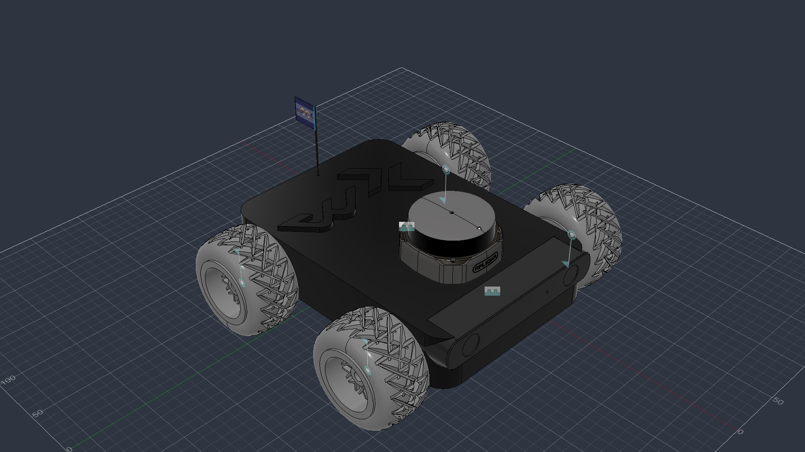

# ma_robot — Robot Description



## Overview

| Property | Value |
|----------|-------|
| Total mass | 5.728 kg |
| Links | 7 |
| Joints | 6 (4 movable) |
| Assemblies | 5 |
| Root link | `base_link` |

## Table of Contents

- [Kinematic Tree](#kinematic-tree)
- [Link Properties](#link-properties)
- [Joint Properties](#joint-properties)
- [Assembly Breakdown](#assembly-breakdown)
- [Quick Start (ROS 2)](#quick-start-ros-2)
- [Files](#files)

## Kinematic Tree

```
base_link
  └─ zed2_camera_joint [fixed]
    zed2_camera_link
  └─ rear_left_wheel_joint [continuous]
    rear_left_wheel_link [BAKE]
  └─ front_right_wheel_joint [continuous]
    front_right_wheel_link [BAKE]
  └─ rear_right_wheel_joint [continuous]
    rear_right_wheel_link [BAKE]
  └─ front_left_wheel_joint [continuous]
    front_left_wheel_link [BAKE]
  └─ rplidar_s2_joint [fixed]
    rplidar_s2_link
```

## Link Properties

| Link | Mass (kg) | Material | Collision | Bodies |
|------|-----------|----------|-----------|--------|
| `base_link` | 2.8992 | Acetal_Resin_Black | cylinder | 2 |
| `front_left_wheel_link` | 0.6116 | Steel | box | 1 |
| `front_right_wheel_link` | 0.6116 | Steel | box | 1 |
| `rear_left_wheel_link` | 0.6116 | Steel | box | 1 |
| `rear_right_wheel_link` | 0.6116 | Steel | box | 1 |
| `rplidar_s2_link` | 0.2038 | Steel | box | 28 |
| `zed2_camera_link` | 0.1782 | PA_11_Nylon_HP_11_30_with_EOS_P_396_3D_Printer | box | 1 |

## Joint Properties

| Joint | Type | Parent → Child | Axis | Limits |
|-------|------|---------------|------|--------|
| `front_left_wheel_joint` | continuous | `base_link` → `front_left_wheel_link` | (0,0,1) | — |
| `front_right_wheel_joint` | continuous | `base_link` → `front_right_wheel_link` | (0,0,1) | — |
| `rear_left_wheel_joint` | continuous | `base_link` → `rear_left_wheel_link` | (0,0,1) | — |
| `rear_right_wheel_joint` | continuous | `base_link` → `rear_right_wheel_link` | (0,0,1) | — |
| `rplidar_s2_joint` | fixed | `base_link` → `rplidar_s2_link` | (0,0,1) | — |
| `zed2_camera_joint` | fixed | `base_link` → `zed2_camera_link` | (0,0,1) | — |

## Assembly Breakdown

### front_left_wheel_link

- **Links**: front_left_wheel_link
- **Total mass**: 0.612 kg

### front_right_wheel_link

- **Links**: front_right_wheel_link
- **Total mass**: 0.612 kg

### ma_robot

- **Links**: base_link, zed2_camera_link, rplidar_s2_link
- **Total mass**: 3.281 kg

### rear_left_wheel_link

- **Links**: rear_left_wheel_link
- **Total mass**: 0.612 kg

### rear_right_wheel_link

- **Links**: rear_right_wheel_link
- **Total mass**: 0.612 kg

## Quick Start (ROS 2)

```bash
# 1. Copy package to your ROS 2 workspace
cp -r ma_robot_description ~/ros2_ws/src/

# 2. Build
cd ~/ros2_ws
colcon build --packages-select ma_robot_description
source install/setup.bash

# 3. Visualize in RViz2
ros2 launch ma_robot_description display.launch.py

# 4. Validate URDF structure
check_urdf install/ma_robot_description/share/ma_robot_description/urdf/ma_robot.urdf

# 5. Print kinematic tree
urdf_to_graphviz install/ma_robot_description/share/ma_robot_description/urdf/ma_robot.urdf
```

**Joint control**: The launch file includes `joint_state_publisher_gui` —
use the sliders to move revolute/prismatic joints in RViz2.

**Topic inspection**:
```bash
# See published joint states
ros2 topic echo /joint_states

# See robot description parameter
ros2 param get /robot_state_publisher robot_description
```

## Files

| Path | Description |
|------|-------------|
| `urdf/ma_robot.urdf.xacro` | Top-level xacro (entry point) |
| `urdf/ma_robot.urdf` | Flat URDF (for validation) |
| `urdf/assemblies/` | Per-assembly xacro macros |
| `meshes/` | Visual (OBJ) and collision (STL) meshes |
| `launch/display.launch.py` | Launch robot_state_publisher, RViz, and generated controllers |
| `config/joint_state.yaml` | Joint state publisher config |
| `config/ros2_controllers.yaml` | Generated ros2_control controller manager config |
| `robot_data.yaml` | Supplementary data (beyond URDF) |
| `docs/transforms.md` | Transformation matrices (KaTeX) |

## Customizing

Assemblies tagged `!dummy_` are designed to be swapped out. To replace one:

1. Create your replacement as a xacro macro with the same interface
2. Place it in `urdf/assemblies/`
3. Update the `<xacro:include>` in `urdf/ma_robot.urdf.xacro`
4. Update meshes in `meshes/<your_assembly>/`

The xacro prefix system (`${prefix}`) ensures link names stay unique
when multiple instances of the same assembly are used.

---
*Generated by Fusion URDF/XACRO Exporter v3.1.0*