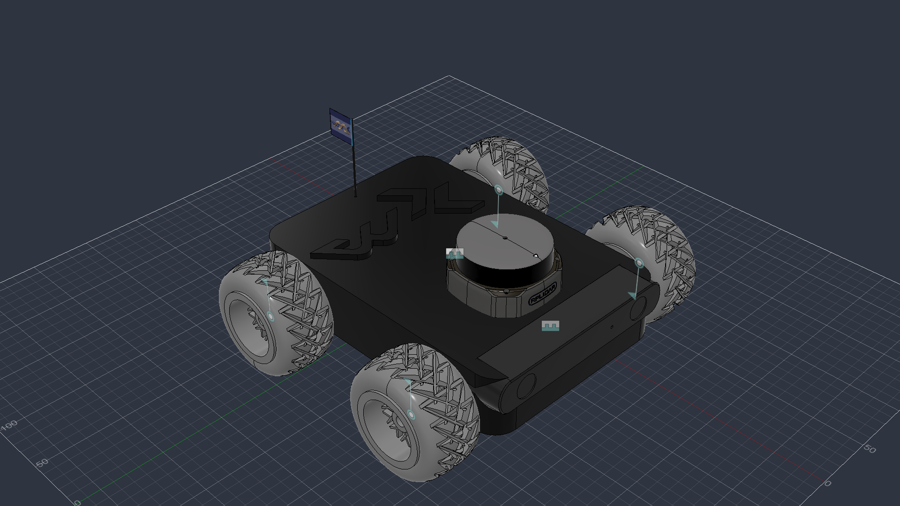

# mabot — Robot Description



## Overview

| Property | Value |
|----------|-------|
| Total mass | 5.728 kg |
| Links | 7 |
| Joints | 6 (4 movable) |
| Assemblies | 5 |
| Root link | `base_link` |

## Table of Contents

- [Kinematic Tree](#kinematic-tree)
- [Link Properties](#link-properties)
- [Joint Properties](#joint-properties)
- [Assembly Breakdown](#assembly-breakdown)
- [Quick Start (ROS 2)](#quick-start-ros-2)
- [Files](#files)

## Kinematic Tree

```
base_link
  └─ zed2_camera_joint [fixed]
    zed2_camera_link
  └─ rear_left_wheel_joint [continuous]
    rear_left_wheel_link [BAKE]
  └─ front_right_wheel_joint [continuous]
    front_right_wheel_link [BAKE]
  └─ rear_right_wheel_joint [continuous]
    rear_right_wheel_link [BAKE]
  └─ front_left_wheel_joint [continuous]
    front_left_wheel_link [BAKE]
  └─ rplidar_s2_joint [fixed]
    rplidar_s2_link
```

## Link Properties

| Link | Mass (kg) | Material | Collision | Bodies |
|------|-----------|----------|-----------|--------|
| `base_link` | 2.8992 | Acetal_Resin_Black | cylinder | 2 |
| `front_left_wheel_link` | 0.6116 | Steel | box | 1 |
| `front_right_wheel_link` | 0.6116 | Steel | box | 1 |
| `rear_left_wheel_link` | 0.6116 | Steel | box | 1 |
| `rear_right_wheel_link` | 0.6116 | Steel | box | 1 |
| `rplidar_s2_link` | 0.2038 | Steel | box | 28 |
| `zed2_camera_link` | 0.1782 | PA_11_Nylon_HP_11_30_with_EOS_P_396_3D_Printer | box | 1 |

## Joint Properties

| Joint | Type | Parent → Child | Axis | Limits |
|-------|------|---------------|------|--------|
| `front_left_wheel_joint` | continuous | `base_link` → `front_left_wheel_link` | (0,0,1) | — |
| `front_right_wheel_joint` | continuous | `base_link` → `front_right_wheel_link` | (0,0,1) | — |
| `rear_left_wheel_joint` | continuous | `base_link` → `rear_left_wheel_link` | (0,0,1) | — |
| `rear_right_wheel_joint` | continuous | `base_link` → `rear_right_wheel_link` | (0,0,1) | — |
| `rplidar_s2_joint` | fixed | `base_link` → `rplidar_s2_link` | (0,0,1) | — |
| `zed2_camera_joint` | fixed | `base_link` → `zed2_camera_link` | (0,0,1) | — |

## Assembly Breakdown

### front_left_wheel_link

- **Links**: front_left_wheel_link
- **Total mass**: 0.612 kg

### front_right_wheel_link

- **Links**: front_right_wheel_link
- **Total mass**: 0.612 kg

### mabot

- **Links**: base_link, zed2_camera_link, rplidar_s2_link
- **Total mass**: 3.281 kg

### rear_left_wheel_link

- **Links**: rear_left_wheel_link
- **Total mass**: 0.612 kg

### rear_right_wheel_link

- **Links**: rear_right_wheel_link
- **Total mass**: 0.612 kg

## Quick Start (ROS 2)

```bash
# 1. Copy package to your ROS 2 workspace
cp -r mabot_description ~/ros2_ws/src/

# 2. Build
cd ~/ros2_ws
colcon build --packages-select mabot_description
source install/setup.bash

# 3. Visualize in RViz2
ros2 launch mabot_description display.launch.py

# 4. Validate URDF structure
check_urdf install/mabot_description/share/mabot_description/urdf/mabot.urdf

# 5. Print kinematic tree
urdf_to_graphviz install/mabot_description/share/mabot_description/urdf/mabot.urdf
```

**Joint control**: The launch file includes `joint_state_publisher_gui` —
use the sliders to move revolute/prismatic joints in RViz2.

**Topic inspection**:
```bash
# See published joint states
ros2 topic echo /joint_states

# See robot description parameter
ros2 param get /robot_state_publisher robot_description
```

## Files

| Path | Description |
|------|-------------|
| `urdf/mabot.urdf.xacro` | Top-level xacro (entry point) |
| `urdf/mabot.urdf` | Flat URDF (for validation) |
| `urdf/assemblies/` | Per-assembly xacro macros |
| `meshes/` | Visual (OBJ) and collision (STL) meshes |
| `launch/display.launch.py` | Launch robot_state_publisher, RViz, and generated controllers |
| `config/joint_state.yaml` | Joint state publisher config |
| `config/ros2_controllers.yaml` | Generated ros2_control controller manager config |
| `robot_data.yaml` | Supplementary data (beyond URDF) |
| `docs/transforms.md` | Transformation matrices (KaTeX) |

## Customizing

Assemblies tagged `!dummy_` are designed to be swapped out. To replace one:

1. Create your replacement as a xacro macro with the same interface
2. Place it in `urdf/assemblies/`
3. Update the `<xacro:include>` in `urdf/mabot.urdf.xacro`
4. Update meshes in `meshes/<your_assembly>/`

The xacro prefix system (`${prefix}`) ensures link names stay unique
when multiple instances of the same assembly are used.


# Transformation Matrices - mabot

Homogeneous transformation matrices between consecutive frames.
Convention: URDF RPY (XYZ extrinsic / ZYX intrinsic).

## Notation

### Frames

| Index | Link |
|-------|------|
| $L_{0}$ | base_link |
| $L_{1}$ | zed2_camera_link |
| $L_{2}$ | rear_left_wheel_link |
| $L_{3}$ | front_right_wheel_link |
| $L_{4}$ | rear_right_wheel_link |
| $L_{5}$ | front_left_wheel_link |
| $L_{6}$ | rplidar_s2_link |

### Joint Variables

| Variable | Joint | Type | From | To |
|----------|-------|------|------|----|
| $q_{1}$ | rear_left_wheel_joint | continuous (rad) | $L_{0}$ | $L_{2}$ |
| $q_{2}$ | front_right_wheel_joint | continuous (rad) | $L_{0}$ | $L_{3}$ |
| $q_{3}$ | rear_right_wheel_joint | continuous (rad) | $L_{0}$ | $L_{4}$ |
| $q_{4}$ | front_left_wheel_joint | continuous (rad) | $L_{0}$ | $L_{5}$ |

Shorthand: $c_i = \cos(q_i)$, $s_i = \sin(q_i)$

### Kinematic Tree

```
L0: base_link
  |-- [fixed] zed2_camera_joint
  |   L1: zed2_camera_link
  |-- [continuous] rear_left_wheel_joint (q1)
  |   L2: rear_left_wheel_link
  |-- [continuous] front_right_wheel_joint (q2)
  |   L3: front_right_wheel_link
  |-- [continuous] rear_right_wheel_joint (q3)
  |   L4: rear_right_wheel_link
  |-- [continuous] front_left_wheel_joint (q4)
  |   L5: front_left_wheel_link
  +-- [fixed] rplidar_s2_joint
      L6: rplidar_s2_link
```

## Transforms

## zed2_camera_joint

$L_{0}$ **base_link** -> $L_{1}$ **zed2_camera_link** (fixed)

- **origin xyz**: (0.145, -0.0625, -0.007371) m
- **origin rpy**: (0, 0, -1.570796) rad

### Local Transform

$$
T^{0}_{1} = \begin{bmatrix}
0 & 1 & 0 & 0.145 \\
-1 & 0 & 0 & -0.0625 \\
0 & 0 & 1 & -0.007371 \\
0 & 0 & 0 & 1 \\
\end{bmatrix}
$$

---

## rear_left_wheel_joint

$L_{0}$ **base_link** -> $L_{2}$ **rear_left_wheel_link** (continuous)
  Variable: $q_{1}$

- **origin xyz**: (-0.0529, 0.132477, 0.083048) m
- **origin rpy**: (-1.570796, 0, 0) rad
- **axis**: (0, 0, 1)

### Local Transform

$T^{0}_{2}(q_{1}) = T_{fixed} \cdot R_{axis}(q_{1})$ where:

$$
T_{fixed} = \begin{bmatrix}
1 & 0 & 0 & -0.0529 \\
0 & 0 & 1 & 0.132477 \\
0 & -1 & 0 & 0.083048 \\
0 & 0 & 0 & 1 \\
\end{bmatrix}
$$

$$
R_{axis}(q_{1}) = \begin{bmatrix}
c_{1} & -s_{1} & 0 & 0 \\
s_{1} & c_{1} & 0 & 0 \\
0 & 0 & 1 & 0 \\
0 & 0 & 0 & 1 \\
\end{bmatrix}
$$

---

## front_right_wheel_joint

$L_{0}$ **base_link** -> $L_{3}$ **front_right_wheel_link** (continuous)
  Variable: $q_{2}$

- **origin xyz**: (0.0129, 0.001523, 0.083048) m
- **origin rpy**: (1.570796, 0, 0) rad
- **axis**: (0, 0, 1)

### Local Transform

$T^{0}_{3}(q_{2}) = T_{fixed} \cdot R_{axis}(q_{2})$ where:

$$
T_{fixed} = \begin{bmatrix}
1 & 0 & 0 & 0.0129 \\
0 & 0 & -1 & 0.001523 \\
0 & 1 & 0 & 0.083048 \\
0 & 0 & 0 & 1 \\
\end{bmatrix}
$$

$$
R_{axis}(q_{2}) = \begin{bmatrix}
c_{2} & -s_{2} & 0 & 0 \\
s_{2} & c_{2} & 0 & 0 \\
0 & 0 & 1 & 0 \\
0 & 0 & 0 & 1 \\
\end{bmatrix}
$$

---

## rear_right_wheel_joint

$L_{0}$ **base_link** -> $L_{4}$ **rear_right_wheel_link** (continuous)
  Variable: $q_{3}$

- **origin xyz**: (-0.0529, 0.003523, -0.043048) m
- **origin rpy**: (1.570796, 0, 0) rad
- **axis**: (0, 0, 1)

### Local Transform

$T^{0}_{4}(q_{3}) = T_{fixed} \cdot R_{axis}(q_{3})$ where:

$$
T_{fixed} = \begin{bmatrix}
1 & 0 & 0 & -0.0529 \\
0 & 0 & -1 & 0.003523 \\
0 & 1 & 0 & -0.043048 \\
0 & 0 & 0 & 1 \\
\end{bmatrix}
$$

$$
R_{axis}(q_{3}) = \begin{bmatrix}
c_{3} & -s_{3} & 0 & 0 \\
s_{3} & c_{3} & 0 & 0 \\
0 & 0 & 1 & 0 \\
0 & 0 & 0 & 1 \\
\end{bmatrix}
$$

---

## front_left_wheel_joint

$L_{0}$ **base_link** -> $L_{5}$ **front_left_wheel_link** (continuous)
  Variable: $q_{4}$

- **origin xyz**: (0.0129, 0.124477, -0.043048) m
- **origin rpy**: (-1.570796, 0, 0) rad
- **axis**: (0, 0, 1)

### Local Transform

$T^{0}_{5}(q_{4}) = T_{fixed} \cdot R_{axis}(q_{4})$ where:

$$
T_{fixed} = \begin{bmatrix}
1 & 0 & 0 & 0.0129 \\
0 & 0 & 1 & 0.124477 \\
0 & -1 & 0 & -0.043048 \\
0 & 0 & 0 & 1 \\
\end{bmatrix}
$$

$$
R_{axis}(q_{4}) = \begin{bmatrix}
c_{4} & -s_{4} & 0 & 0 \\
s_{4} & c_{4} & 0 & 0 \\
0 & 0 & 1 & 0 \\
0 & 0 & 0 & 1 \\
\end{bmatrix}
$$

---

## rplidar_s2_joint

$L_{0}$ **base_link** -> $L_{6}$ **rplidar_s2_link** (fixed)

- **origin xyz**: (-0.433747, -0.657506, 0.046815) m
- **origin rpy**: (0, 0, -1.570796) rad

### Local Transform

$$
T^{0}_{6} = \begin{bmatrix}
0 & 1 & 0 & -0.433747 \\
-1 & 0 & 0 & -0.657506 \\
0 & 0 & 1 & 0.046815 \\
0 & 0 & 0 & 1 \\
\end{bmatrix}
$$

---

## Global Transform Chains

Transform from root $L_0$ to any link, as product of local transforms along the kinematic chain.

