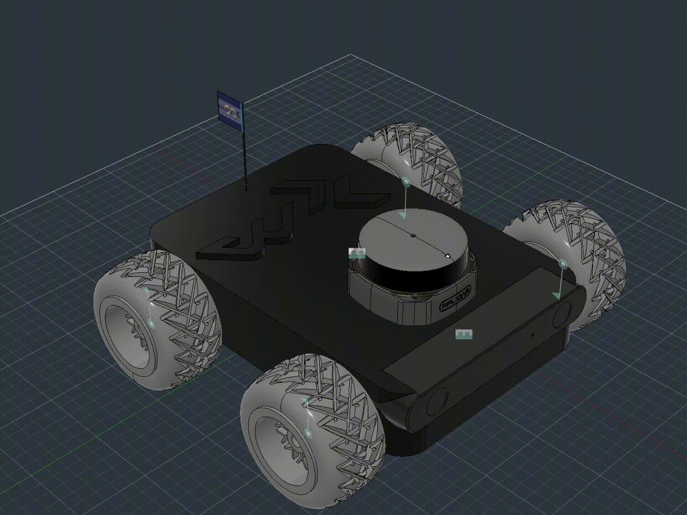
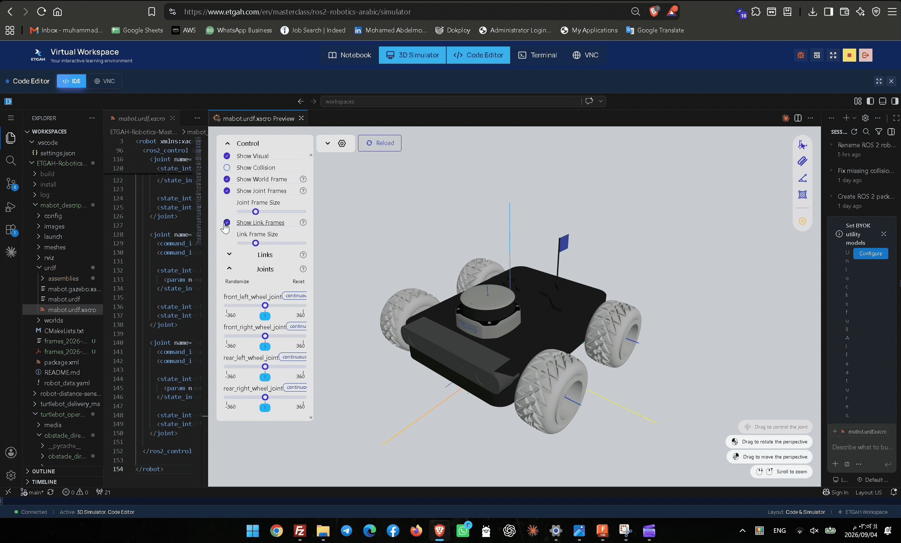

<div align="center">

<h1>MABOT</h1>

<h3>Custom Mobile Robot</h3>

<p>
  
  
  <!--  -->
  
</p>

<p>
  A custom  mobile robot designed in Autodesk Fusion 360<br>
  and integrated with ROS 2 and Gazebo .
</p>

</div>

---

## Project Overview

**MABot** is a custom mobile robot covering the complete development workflow from mechanical CAD assembly to a reusable Xacro robot description, connected TF tree, differential-drive simulation, LiDAR and RGB-D sensing, ROS–Gazebo topic bridging, autonomous obstacle avoidance and RViz visualization.

The robot was developed as part of the ETGAH ROS 2 Robotics Masterclass. It features a four-wheel skid-steer drivetrain, an RPLIDAR S2, a ZED 2 camera for RGB-D sensing, depth and point-cloud output, a standard optical camera frame, a custom Gazebo world and ETGAH Virtual Workspace support.

> This README uses the final project name `MABot` and the ROS 2 package name `mabot_description`.

<p align="center">
  
</p>

<p align="center">
  <em>Complete MABot four-wheel mobile robot model.</em>
</p>

---

## Tools and Platforms

<div align="center">

<table>
  <tr>
    <td align="center" width="33%">
      <a href="https://www.autodesk.com/products/fusion-360/overview">
        
      </a>
      <br>
      <strong>Autodesk Fusion 360</strong>
      <br>
      <sub>CAD modeling and robot assembly</sub>
    </td>
    <td align="center" width="33%">
      <a href="https://grabcad.com/">
        
      </a>
      <br>
      <strong>GrabCAD</strong>
      <br>
      <sub>Wheel and LiDAR CAD sources</sub>
   <td align="center" width="33%">
  <a href="https://www.etgah.com/en">
    
  </a>
  <br>
  <strong>ETGAH Virtual Workspace</strong>
  <br>
  <sub>ROS 2 learning and simulation environment</sub>
</td>
  </tr>
</table>

</div>

---

## Project Preview

### Fusion 360 assembly

The main body was modeled manually in Fusion 360. External CAD models were integrated as separate components before defining the wheel and sensor relationships.



*Assembly of the MABot mechanical components in Autodesk Fusion 360.*

### Final robot


*Complete MABot four-wheel mobile robot model.*

---

## Table of Contents

- [Tools and Platforms](#tools-and-platforms)
- [Project Overview](#project-overview)
- [Main Features](#main-features)
- [Development Workflow](#development-workflow)
- [Mechanical Design](#mechanical-design)
- [CAD Models and External Assets](#cad-models-and-external-assets)
- [Software and Tested Versions](#software-and-tested-versions)
- [Robot Coordinate Convention](#robot-coordinate-convention)
- [TF Tree](#tf-tree)
- [ROS 2 Package Structure](#ros-2-package-structure)
- [URDF and Xacro Organization](#urdf-and-xacro-organization)
- [Gazebo Integration](#gazebo-integration)
- [Sensor Simulation](#sensor-simulation)
- [ROS–Gazebo Bridge](#rosgazebo-bridge)
- [ROS 2 Topics](#ros-2-topics)
- [Build and Validation](#build-and-validation)
- [Running the Simulation](#running-the-simulation)
- [Robot Control Methods](#robot-control-methods)
- [RViz Visualization](#rviz-visualization)
- [References and Credits](#references-and-credits)

---

<!-- ## Project Overview

MABot is a skid-steer mobile robot with four independently modeled wheels. Gazebo's differential-drive system commands the two wheels on each side as one drive group.

The complete pipeline is:

```text
Fusion 360 CAD Assembly
        ↓
Fusion URDF/Xacro Exporter
        ↓
ROS 2 Robot Description Package
        ↓
Manual Joint, Mesh and Frame Corrections
        ↓
Gazebo Harmonic Physics and Sensor Systems
        ↓
ros_gz_bridge and ros_gz_image
        ↓
TF, Odometry, LaserScan, RGB, Depth and Point Cloud
        ↓
RViz 2 Visualization and Keyboard Teleoperation
```

The project repository is available at:

[github.com/men3m-4/ETGAH-Robotics-Masterclass](https://github.com/men3m-4/ETGAH-Robotics-Masterclass)

--- -->

## Main Features

- Custom robot chassis designed and assembled in Fusion 360.
- Four-wheel skid-steer / differential-drive configuration.
- Reusable Xacro macros for the robot and individual wheel assemblies.
- Visual, collision and inertial properties for every physical link.
- Ground-level `base_footprint` frame aligned with the kinematic center.
- Physical `base_link` with its original CAD origin and inertia.
- Four continuous wheel joints with corrected mirrored axes.
- RPLIDAR S2 visual model and simulated 360-degree GPU LiDAR.
- ZED 2 camera model with simulated RGB-D sensing.
- Standard `zed2_camera_optical_link` in the TF tree.
- RGB image, depth image and colored point-cloud output.
- Gazebo Joint State Publisher system.
- Gazebo four-wheel DiffDrive system.
- Odometry and `odom → base_footprint` transform publishing.
- YAML-based ROS–Gazebo bridge configuration.
- Dedicated `ros_gz_image` bridge for `/camera/image_raw`.
- RViz configuration for the robot, TF, LiDAR, camera, point cloud and odometry.
- Gazebo server-only mode for the ETGAH 3D Simulator.
- Optional local Gazebo GUI for standalone use.
- Three verified motion modes: ETGAH Control, keyboard teleoperation and MABot autonomous obstacle avoidance.
- Parameterized `mabot_autopilot_node` with six LiDAR safety sectors, speed control, reverse recovery and scan-timeout protection.

---

## Development Workflow

### 1. Mechanical concept

The project started as a custom mobile robot concept rather than a prebuilt educational platform. The robot body and its structural arrangement were created manually, while selected sensor and wheel models were imported into Fusion 360.

### 2. Fusion 360 assembly

The chassis, four wheel components, camera and LiDAR were positioned as a complete assembly. Each physical element intended to become a ROS link was kept as a separate Fusion component.

The wheel components were connected using revolute relationships, while the camera and LiDAR were fixed to the main body.

### 3. URDF/Xacro export

The Fusion model was exported using **Fusion URDF/Xacro Exporter 3.1.0**. The generated COLLADA files confirm:

```xml
<authoring_tool>Fusion URDF/XACRO Exporter</authoring_tool>
<unit name="meter" meter="1.0"/>
<up_axis>Z_UP</up_axis>
```

The exporter generated the initial package structure, link mass properties, inertia matrices, meshes, assembly macros, configuration files and RViz launch files.

### 4. Gazebo and ROS 2 integration

Gazebo plugins and sensors were added after the URDF rendered correctly. The robot was then tested layer by layer:

1. Xacro expansion.
2. URDF parsing.
3. TF connectivity.
4. Gazebo spawning.
5. Direct `/cmd_vel` motion.
6. Keyboard teleoperation.
7. Joint states and odometry.
8. LiDAR output.
9. RGB image and depth output.
10. Point-cloud position and orientation.

---

## Mechanical Design

### Main dimensions

| Property | Value |
|---|---:|
| Chassis length | `250 mm` |
| Chassis width | `175 mm` |
| Chassis height | `50 mm` |
| Wheel outside diameter | `90 mm` |
| Gazebo wheel radius | `0.045 m` |
| Approximate longitudinal wheelbase | `150 mm` |
| DiffDrive wheel separation | `0.246 m` |
| Measured CAD-origin height above ground | `26.386 mm` |
### Final wheel-joint positions

| Joint | X | Y | Z | Axis |
|---|---:|---:|---:|---|
| `front_left_wheel_joint` | `0.130 m` | `0.060 m` | `0.020 m` | `0 0 1` |
| `front_right_wheel_joint` | `0.130 m` | `-0.185 m` | `0.020 m` | `0 0 -1` |
| `rear_left_wheel_joint` | `-0.020 m` | `0.060 m` | `0.020 m` | `0 0 1` |
| `rear_right_wheel_joint` | `-0.020 m` | `-0.187 m` | `0.020 m` | `0 0 -1` |

The right-wheel axes are reversed because their component frames are mirrored relative to the left side.

---

## CAD Models and External Assets

Project media used in this README is stored in the package's `images/` directory.

### External-model sources

| Part | Original creator / provider | Source and publication date | Project usage |
|---|---|---|---|
| Wheel | [devang](https://grabcad.com/devang-13) | [Wheel 953 — GrabCAD](https://grabcad.com/library/wheel-953), August 17, 2026 | Imported into Fusion 360, then duplicated and mirrored to create the four wheel assemblies |
| RPLIDAR S2 | [Brian Keathley](https://grabcad.com/brian.keathley-1) | [RP LIDAR S2 Slamtec — GrabCAD](https://grabcad.com/library/rp-lidar-s2-slamtec-2), December 28, 2021 | Imported as the physical LiDAR reference and converted into the final ROS visual mesh |
| ZED 2 stereo camera | [Stereolabs](https://www.stereolabs.com/) | [Official Stereolabs 3D models](https://www.stereolabs.com/en-ae/3dmodels) and [official ZED2 STEP download](https://cdn.sanity.io/files/s18ewfw4/staging/0ca606adbc0b3796b90589e20d9432a0a4d65ce0.step/ZED2.step) | Official STEP geometry used as the camera reference; published size `124.5 × 30.5 × 26.5 mm`, mass `60 g` |

All remaining mechanical components—including the chassis, structural parts, sensor mounting arrangement and complete Fusion 360 assembly—were designed and assembled by **Mohamed Abdelmoniem**.

---

## Software and Tested Versions

| Software | Version / distribution | Purpose |
|---|---|---|
| ROS 2 | Jazzy | Nodes, topics, TF, Xacro and launch system |
| Gazebo Sim | `8.11.0` | Physics, drive system and sensor simulation |
| Gazebo release family | Harmonic | ROS 2 Jazzy simulation environment |
| Fusion URDF/Xacro Exporter | `3.1.0` | CAD-to-ROS package export |
| Autodesk Fusion 360 | Project CAD tool | Modeling and assembly |
| RViz 2 | Jazzy package | Robot and sensor visualization |
| VS Code | Current workspace editor | Source editing and URDF preview |

---

## Robot Coordinate Convention

MABot follows the standard mobile-robot convention:

- `+X`: forward.
- `+Y`: left.
- `+Z`: upward.

The physical camera frame follows the robot convention. Its optical child frame follows the ROS camera convention:

- Optical `+Z`: forward through the lens.
- Optical `+X`: right in the image.
- Optical `+Y`: down in the image.

Keeping the physical sensor frame separate from its optical frame prevents visual-mesh orientation from being confused with image-coordinate orientation.

---

## TF Tree

```text
odom
└── base_footprint
    └── base_link
        ├── front_left_wheel_link
        ├── front_right_wheel_link
        ├── rear_left_wheel_link
        ├── rear_right_wheel_link
        ├── rplidar_s2_link
        └── zed2_camera_link
            └── zed2_camera_optical_link
```


*Connected MABot TF hierarchy, including `odom`, `base_footprint`, `base_link`, the wheel links, `rplidar_s2_link`, `zed2_camera_link`, and `zed2_camera_optical_link`.*

[Download the complete MABot TF tree PDF](images/frames_2026-09-04_07.41.24.pdf)

### Transform publishers

| Transform | Publisher |
|---|---|
| `odom → base_footprint` | Gazebo DiffDrive system through `/tf` |
| `base_footprint → base_link` | `robot_state_publisher` |
| `base_link → wheel links` | `robot_state_publisher` using `/joint_states` |
| `base_link → rplidar_s2_link` | `robot_state_publisher` |
| `base_link → zed2_camera_link` | `robot_state_publisher` |
| `zed2_camera_link → zed2_camera_optical_link` | `robot_state_publisher` |

### Ground-level kinematic frame

The original Fusion CAD origin was not located at the wheel-group center. The final fixed transform is:

```xml
<joint name="base_footprint_joint" type="fixed">
  <parent link="base_footprint"/>
  <child link="base_link"/>
  <origin xyz="-0.055000 0.062500 0.026386"
          rpy="0.000000 0.000000 0.000000"/>
</joint>
```

The transform was verified with:

```bash
ros2 run tf2_ros tf2_echo base_footprint base_link
```

Expected translation:

```text
[-0.055, 0.062, 0.026]
```

### Camera optical transform

```xml
<joint name="zed2_camera_optical_joint" type="fixed">
  <parent link="zed2_camera_link"/>
  <child link="zed2_camera_optical_link"/>
  <origin xyz="0 0 0" rpy="-1.570796 0 -1.570796"/>
</joint>
```

---

## ROS 2 Package Structure

```text
mabot_description/
├── CMakeLists.txt
├── package.xml
├── README.md
├── robot_data.yaml
├── images/
├── config/
│   ├── FRAME_OVERRIDES.md
│   ├── frame_overrides.csv
│   ├── gz_bridge.yaml
│   ├── joint_state.yaml
│   └── ros2_controllers.yaml
├── launch/
│   ├── display.launch.py
│   └── gazebo.launch.py
├── meshes/
│   ├── front_left_wheel_link/
│   ├── front_right_wheel_link/
│   ├── mabot/
│   ├── rear_left_wheel_link/
│   └── rear_right_wheel_link/
├── rviz/
│   └── display.rviz
├── urdf/
│   ├── assemblies/
│   │   ├── front_left_wheel_link.urdf.xacro
│   │   ├── front_right_wheel_link.urdf.xacro
│   │   ├── mabot.urdf.xacro
│   │   ├── rear_left_wheel_link.urdf.xacro
│   │   └── rear_right_wheel_link.urdf.xacro
│   ├── mabot.gazebo.xacro
│   └── mabot.urdf.xacro
└── worlds/
    └── mabot_world.sdf
```

README media is stored under `mabot_description/images/`, so all paths remain relative to this file and work directly on GitHub.

---

## URDF and Xacro Organization

The top-level `mabot.urdf.xacro` file:

- Defines shared materials.
- Includes the four wheel macros.
- Includes the main MABot assembly macro.
- Includes the Gazebo-specific Xacro file.
- Instantiates all assemblies.
- Defines the four continuous wheel joints.
- Defines the existing ROS 2 control interfaces.

The assembly macros keep link definitions reusable and isolate exported mesh offsets from the main kinematic tree.

All mesh resources use package URIs:

```xml
<mesh filename="package://mabot_description/meshes/..."/>
```



*Complete MABot model with meshes, links and joints displayed in the VS Code URDF Visualizer.*

---

## Sensor Simulation

### RPLIDAR S2

| Parameter | Value |
|---|---:|
| Sensor type | `gpu_lidar` |
| Topic | `/scan` |
| Frame | `rplidar_s2_link` |
| Update rate | `10 Hz` |
| Horizontal samples | `720` |
| Horizontal field | `-π` to `+π` |
| Minimum range | `0.15 m` |
| Maximum range | `30.0 m` |
| Range resolution | `0.01 m` |
| Noise | Gaussian, `σ = 0.01` |

### ZED2 RGB-D camera

| Parameter | Value |
|---|---:|
| Sensor type | `rgbd_camera` |
| Gazebo base topic | `/camera` |
| Sensor frame | `zed2_camera_link` |
| Requested update rate | `30 Hz` |
| Horizontal FOV | `1.92 rad` |
| RGB resolution | `640 × 480` |
| Image format | `R8G8B8` |
| RGB clipping range | `0.10–20.0 m` |
| Depth clipping range | `0.20–20.0 m` |

The camera mesh remains physically mounted in its original orientation, while the sensor frame points forward with MABot's `+X` axis.

---

## ROS–Gazebo Bridge

The bridge configuration is stored in:

```text
config/gz_bridge.yaml
```

| Topic | Direction | ROS message type |
|---|---|---|
| `/clock` | Gazebo → ROS | `rosgraph_msgs/msg/Clock` |
| `/cmd_vel` | ROS → Gazebo | `geometry_msgs/msg/Twist` |
| `/odom` | Gazebo → ROS | `nav_msgs/msg/Odometry` |
| `/tf` | Gazebo → ROS | `tf2_msgs/msg/TFMessage` |
| `/joint_states` | Gazebo → ROS | `sensor_msgs/msg/JointState` |
| `/scan` | Gazebo → ROS | `sensor_msgs/msg/LaserScan` |
| `/camera/camera_info` | Gazebo → ROS | `sensor_msgs/msg/CameraInfo` |
| `/camera/depth_image` | Gazebo → ROS | `sensor_msgs/msg/Image` |
| `/camera/points` | Gazebo → ROS | `sensor_msgs/msg/PointCloud2` |

The RGB image is intentionally handled by the dedicated image bridge:

```text
ros_gz_image/image_bridge
```

Gazebo publishes `/camera/image`, and the launch file remaps the ROS output to:

```text
/camera/image_raw
```

---

## ROS 2 Topics

Expected topics after launching the simulation:

```text
/camera/camera_info
/camera/depth_image
/camera/image_raw
/camera/points
/clock
/cmd_vel
/joint_states
/odom
/robot_description
/scan
/tf
/tf_static
```

Additional image-transport topics may appear if their plugins are installed:

```text
/camera/image_raw/compressed
/camera/image_raw/compressedDepth
/camera/image_raw/theora
/camera/image_raw/zstd
```

---

## Build and Validation

### Prerequisites

Source ROS 2 Jazzy:

```bash
source /opt/ros/jazzy/setup.bash
```

Install missing dependencies if required:

```bash
cd ~/workspaces/ETGAH-Robotics-Masterclass
rosdep install --from-paths . --ignore-src -r -y
```

### Build

```bash
cd ~/workspaces/ETGAH-Robotics-Masterclass

colcon build --symlink-install \
  --packages-select mabot_description

source install/setup.bash
```

### Generate and validate URDF

```bash
xacro mabot_description/urdf/mabot.urdf.xacro \
  > /tmp/mabot_check.urdf

check_urdf /tmp/mabot_check.urdf
```

### Validate the Gazebo world

```bash
gz sdf -k mabot_description/worlds/mabot_world.sdf
```

Expected output:

```text
Valid.
```

### Validate launch and package files

```bash
python3 -m py_compile \
  mabot_description/launch/display.launch.py \
  mabot_description/launch/gazebo.launch.py

xmllint --noout mabot_description/package.xml
```

---

## Running the Simulation

### ETGAH 3D Simulator

The default launch mode starts the Gazebo server without opening a second local Gazebo interface:

```bash
ros2 launch mabot_description gazebo.launch.py
```

The Gazebo arguments are equivalent to:

```text
-r -s -v2
```

- `-r`: start running immediately.
- `-s`: start server only.
- `-v2`: use verbosity level 2.

The ETGAH 3D Simulator connects to this server and provides the graphical interface.

### Standalone Gazebo GUI

Outside ETGAH, enable the local Gazebo GUI:

```bash
ros2 launch mabot_description gazebo.launch.py \
  use_gazebo_gui:=true
```

### RViz

In a second terminal:

```bash
source /opt/ros/jazzy/setup.bash
source ~/workspaces/ETGAH-Robotics-Masterclass/install/setup.bash

ros2 launch mabot_description display.launch.py
```

---

## Robot Control Methods

MABot was successfully driven using three different control methods. All three methods publish `geometry_msgs/msg/Twist` commands on `/cmd_vel`, which are received by the Gazebo DiffDrive system.

> Run only one velocity-command source at a time. Using ETGAH Control, keyboard teleoperation and the autonomous controller simultaneously can produce conflicting `/cmd_vel` commands.

### 1. ETGAH Virtual Workspace control

After launching the simulation, MABot can be driven directly from the **Control** tab in the ETGAH 3D Simulator. The on-screen directional buttons publish motion commands to `/cmd_vel`.

This method was used to verify basic forward, reverse, left and right motion before autonomous testing.

### 2. Keyboard teleoperation

Run in a separate terminal using an English/US keyboard layout:

```bash
source /opt/ros/jazzy/setup.bash
source ~/workspaces/ETGAH-Robotics-Masterclass/install/setup.bash

ros2 run teleop_twist_keyboard teleop_twist_keyboard
```

MABot was tested successfully using `teleop_twist_keyboard` after correcting the mirrored right-wheel axes and aligning the robot's forward direction with `base_link +X`.

Direct forward-motion test:

```bash
ros2 topic pub -r 10 /cmd_vel geometry_msgs/msg/Twist \
  '{linear: {x: 0.2}, angular: {z: 0.0}}'
```

Stop command:

```bash
ros2 topic pub --once /cmd_vel geometry_msgs/msg/Twist \
  '{linear: {x: 0.0}, angular: {z: 0.0}}'
```

### 3. Autonomous obstacle avoidance

A new MABot-specific reactive obstacle-avoidance node was added alongside the original TurtleBot controller.

| Item | Value |
|---|---|
| ROS 2 package | `obstacle_direction_controller` |
| Executable | `mabot_autopilot_node` |
| Python file | `mabot_autopilot_node.py` |
| Source path | `turtlebot_operation_ma/obstacle_direction_controller/obstacle_direction_controller/mabot_autopilot_node.py` |
| LiDAR input | `/scan` — `sensor_msgs/msg/LaserScan` |
| Velocity output | `/cmd_vel` — `geometry_msgs/msg/Twist` |

The controller divides the 360-degree RPLIDAR scan into front, front-left, front-right, left, right and rear safety sectors. It supports gradual slowdown, emergency braking, in-place turning, checked reverse recovery, LiDAR timeout protection and a guaranteed zero-velocity command during shutdown.


*MABot moving autonomously using RPLIDAR data while Gazebo and RViz display the robot, LiDAR scan, RGB-D camera data and odometry.*

Before building the controller, ensure the corrected transform reports zero LiDAR yaw:

```bash
ros2 run tf2_ros tf2_echo base_link rplidar_s2_link
```

Expected rotation:

```text
RPY (degree): [0.000, 0.000, 0.000]
```

Build the autonomous controller and its interface dependency:

```bash
cd ~/workspaces/ETGAH-Robotics-Masterclass

source /opt/ros/jazzy/setup.bash

colcon build --symlink-install \
  --packages-up-to obstacle_direction_controller

source install/setup.bash
```

Confirm that the new executable is installed:

```bash
ros2 pkg executables obstacle_direction_controller
```

Expected entry:

```text
obstacle_direction_controller mabot_autopilot_node
```

Run the controller with its default parameters:

```bash
ros2 run obstacle_direction_controller mabot_autopilot_node
```

#### Experimental high-speed configuration

The following parameter set was tested in the ETGAH simulation to obtain faster forward and reverse motion:

```bash
ros2 run obstacle_direction_controller mabot_autopilot_node \
  --ros-args \
  -p forward_speed:=2.0 \
  -p slow_speed:=0.25 \
  -p reverse_speed:=-0.30 \
  -p turn_speed:=1.20 \
  -p emergency_distance:=0.35 \
  -p stop_distance:=0.20 \
  -p slow_distance:=1.10 \
  -p clear_distance:=0.90
```

| Parameter | Tested value | Function |
|---|---:|---|
| `forward_speed` | `2.0 m/s` | Requested maximum forward velocity |
| `slow_speed` | `0.25 m/s` | Forward velocity near obstacles |
| `reverse_speed` | `-0.30 m/s` | Reverse recovery velocity |
| `turn_speed` | `1.20 rad/s` | In-place angular velocity |
| `emergency_distance` | `0.35 m` | Emergency reaction distance |
| `stop_distance` | `0.20 m` | Forward stop threshold used during the test |
| `slow_distance` | `1.10 m` | Distance at which gradual slowdown begins |
| `clear_distance` | `0.90 m` | Clearance required to leave the turn state |

> **Simulation warning:** `forward_speed:=2.0` is a requested command and the achieved speed may be limited by the wheel-joint, DiffDrive and simulation constraints. Combining it with `stop_distance:=0.20` leaves very little braking margin and can cause collisions. This configuration should be treated as an experimental simulation setting, not a safe real-robot configuration.

Stop autonomous operation with `Ctrl+C`, then send a zero command if required:

```bash
ros2 topic pub --once /cmd_vel geometry_msgs/msg/Twist \
  '{linear: {x: 0.0}, angular: {z: 0.0}}'
```

During testing, verify that only one node publishes to `/cmd_vel`:

```bash
ros2 topic info /cmd_vel -v
```

---

## RViz Visualization

The supplied RViz configuration displays:

- Grid.
- Robot model from `/robot_description`.
- Complete TF tree.
- RPLIDAR scan from `/scan`.
- ZED2 RGB image from `/camera/image_raw`.
- ZED2 point cloud from `/camera/points`.
- Robot odometry from `/odom`.

The global fixed frame is:

```text
odom
```

The camera view targets:

```text
base_link
```

The Odometry display uses `Keep: 1` to show the current pose without leaving a long trail of repeated axis markers behind the robot.

---

## Useful Diagnostic Commands

### Inspect nodes

```bash
ros2 node list | sort | uniq -c
```

### Inspect robot topics

```bash
ros2 topic list | grep -E \
  'cmd_vel|odom|joint_states|scan|camera'
```

### Inspect image and point-cloud frames

```bash
ros2 topic echo /camera/image_raw --once \
  --field header.frame_id

ros2 topic echo /camera/points --once \
  --field header.frame_id
```

### Inspect update rates

```bash
ros2 topic hz /scan
ros2 topic hz /odom
ros2 topic hz /camera/image_raw
```

### Inspect transforms

```bash
ros2 run tf2_ros tf2_echo odom base_footprint
ros2 run tf2_ros tf2_echo base_footprint base_link
ros2 run tf2_ros tf2_echo base_link rplidar_s2_link
ros2 run tf2_ros tf2_echo base_link zed2_camera_link
ros2 run tf2_ros tf2_echo \
  zed2_camera_link zed2_camera_optical_link
```

---

## References and Credits

- [MABot project repository](https://github.com/men3m-4/ETGAH-Robotics-Masterclass)
- [ETGAH TurtleBot3 simulations](https://github.com/ETGAH/turtlebot3_simulations)
- [Wheel 953 by devang on GrabCAD](https://grabcad.com/library/wheel-953)
- [devang's GrabCAD profile](https://grabcad.com/devang-13)
- [RP LIDAR S2 Slamtec by Brian Keathley on GrabCAD](https://grabcad.com/library/rp-lidar-s2-slamtec-2)
- [Brian Keathley's GrabCAD profile](https://grabcad.com/brian.keathley-1)
- [Official Stereolabs 3D models](https://www.stereolabs.com/en-ae/3dmodels)
- [Official ZED2 STEP model](https://cdn.sanity.io/files/s18ewfw4/staging/0ca606adbc0b3796b90589e20d9432a0a4d65ce0.step/ZED2.step)
- [Stereolabs developer documentation](https://docs.stereolabs.com/docs)
- [Fusion2URDF](https://github.com/syuntoku14/fusion2urdf)
- [Gazebo Sim 8 DiffDrive API](https://gazebosim.org/api/sim/8/classgz_1_1sim_1_1systems_1_1DiffDrive.html)
- [ros_gz_image package](https://index.ros.org/p/ros_gz_image/)

### Asset attribution record

The external wheel, LiDAR and camera models are identified above with their creators/providers and original source URLs. If downloaded archives include attribution files, retain them with the corresponding source assets.
