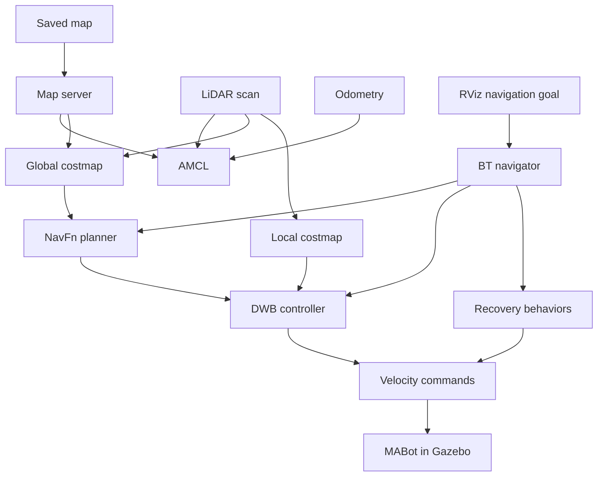

# MABot Navigation

**Map-based autonomous navigation for MABot using ROS 2 Jazzy, Nav2, and Gazebo Harmonic.**

`mabot_navigation` brings localization, path planning, motion control, and recovery behaviors together for the custom four-wheel skid-steer MABot. The robot navigates toward goals selected in RViz using a saved occupancy map and live LiDAR observations.

This package builds on [mabot_description](../mabot_description) for simulation and [mabot_localization](../mabot_localization) for the saved map. Navigation has been tested in the original MABot simulation world.

## Navigation demo

<!-- Place the recorded GIF at repository-root images/mabot_navigation.gif,
     then uncomment the image below.

-->

*Demo recording: GIF to be added.*

## Features

- AMCL localization with manual initial-pose selection in RViz.
- Global planning with the NavFn planner.
- Local trajectory generation and control with DWB.
- Global and local costmaps with LiDAR obstacle observations and inflation.
- A polygon footprint representing the robot's collision geometry.
- Behavior-tree navigation with spin, backup, and wait behaviors.
- Separate lifecycle managers for localization and navigation.
- A saved RViz configuration for repeatable visualization.
- Simulation time shared across the navigation nodes and RViz.

## How it works

The map server supplies the saved map. AMCL estimates the robot's position from LiDAR scans and odometry. The behavior-tree navigator coordinates planning and execution: NavFn computes a global path, and DWB produces velocity commands while evaluating local obstacles.



AMCL publishes `map → odom`; the simulation provides `odom → base_footprint`. The robot description supplies the remaining transforms to the robot links and sensors.

## Package files

| File | Purpose |
| --- | --- |
| `launch/nav2_bringup.launch.py` | Starts the navigation and localization nodes and their lifecycle managers. |
| `config/amcl.yaml` | AMCL particle-filter, sensor, motion-model, and frame settings. |
| `config/planner_server.yaml` | NavFn planner and global costmap settings. |
| `config/controller_server.yaml` | DWB controller and local costmap settings. |
| `config/behavior_server.yaml` | Spin, backup, and wait behaviors. |
| `config/bt_navigator.yaml` | Behavior-tree navigator settings. |
| `rviz/navigation.rviz` | Saved navigation visualization. |
| `CMakeLists.txt` | Installs the package resources. |
| `package.xml` | Package metadata and dependencies. |

The map used by the example below lives in `mabot_localization/map/`; it is passed to the launch file explicitly.

## Requirements

- ROS 2 Jazzy and Gazebo Harmonic.
- Nav2 and its RViz plugins.
- A working MABot simulation with the robot spawned, ROS–Gazebo bridges running, and simulation unpaused.
- A saved map matching the world currently loaded in Gazebo.
- Available `/scan`, `/odom`, `/clock`, and robot TF data.

The navigation launch file starts **neither Gazebo nor RViz**. Start the simulation using the setup documented in [mabot_description](../mabot_description/README.md).

For this workflow, run the AMCL instance supplied by `mabot_navigation`. Stop any separate SLAM/localization launch that also publishes `map → odom`, and stop any independent obstacle-avoidance or teleoperation node publishing velocity commands during autonomous navigation.

## Build

Run from the repository root after sourcing your ROS 2 environment:

```bash
cd ~/workspaces/ETGAH-Robotics-Masterclass
colcon build --symlink-install --packages-select mabot_navigation
source install/setup.bash
```

Source the workspace in each new terminal used for this project.

## Run navigation

### 1. Start the original MABot world

Start the existing MABot Gazebo simulation and its bridges. Use the same world that was used to create `mabot_world_map`.

### 2. Start Nav2

In a new terminal:

```bash
cd ~/workspaces/ETGAH-Robotics-Masterclass
source install/setup.bash

ros2 launch mabot_navigation nav2_bringup.launch.py \
  map:="$PWD/mabot_localization/map/mabot_world_map.yaml"
```

| Launch argument | Description |
| --- | --- |
| `map` | Required absolute path to the saved map YAML. Its referenced image must also be available. |

The current launch configuration uses simulation time.

### 3. Open RViz

In another terminal:

```bash
cd ~/workspaces/ETGAH-Robotics-Masterclass
source install/setup.bash

ros2 run rviz2 rviz2 \
  -d "$PWD/mabot_navigation/rviz/navigation.rviz" \
  --ros-args -p use_sim_time:=true
```

### 4. Set the initial pose

1. Set RViz **Fixed Frame** to `map`.
2. Select **2D Pose Estimate**.
3. Click at the robot's actual position on the map and drag to set its heading.
4. Check that the LiDAR observations align with the mapped walls.
5. Wait for the navigation nodes to become active before sending a goal.

### 5. Send a navigation goal

Use the navigation goal tool in RViz to select a reachable position in free space, then drag to set the desired final heading. Observe the planned path, the robot's motion, and the navigation result in the Nav2 terminal.

An RViz message saying `Setting goal pose` confirms that a goal was selected; check the navigator's result to confirm completion.

## Costmaps and robot footprint

| Setting | Global costmap | Local costmap |
| --- | --- | --- |
| Reference frame | `map` | `odom` |
| Resolution | `0.05 m` | `0.05 m` |
| Rolling window | Disabled | Enabled, `4 × 4 m` |
| Layers | Static, obstacle, inflation | Obstacle, inflation |
| Obstacle source | `/scan` | `/scan` |
| Inflation radius | `0.30 m` | `0.30 m` |
| Cost scaling factor | `8.0` | `8.0` |
| Footprint padding | `0.01 m` | `0.01 m` |

Both costmaps use the following footprint, expressed in meters relative to `base_footprint`:

```yaml
footprint: "[[0.125, 0.150], [-0.140, 0.150], [-0.140, -0.150], [0.125, -0.150]]"
footprint_padding: 0.01
```

This polygon represents an approximately `0.265 × 0.300 m` envelope before padding.

Inflation assigns increasing traversal costs near obstacles. `inflation_radius` controls its extent, while `cost_scaling_factor` controls how quickly costs decay with distance. A larger scaling factor makes the decay faster. Colored inflation cells do not all represent forbidden space; collision checks still depend on the robot footprint and obstacle occupancy.

## RViz visualization

Useful displays for this workflow include:

| Display | Topic / setting |
| --- | --- |
| Map | `/map`, Color Scheme: `map` |
| Global costmap | `/global_costmap/costmap`, Color Scheme: `costmap` |
| Local costmap | `/local_costmap/costmap`, Color Scheme: `costmap` |
| LaserScan | `/scan` |
| Global path | `/plan` |
| RobotModel and TF | Robot description and transform tree |
| AMCL ParticleCloud | `/particle_cloud`, using the Nav2 ParticleCloud display |

Camera and point-cloud displays are optional; the configured costmaps use the LiDAR scan for obstacle observations.

To preserve changes, use **File → Save Config As** and save to:

```text
mabot_navigation/rviz/navigation.rviz
```

<!-- Use **Ctrl+S** for subsequent changes. The saved configuration stores the display setup; set the robot's initial pose for each new localization session as needed. -->
<!-- 
## Troubleshooting

### Goal rejected: action server is inactive

Inspect the node states:

```bash
for node in map_server amcl planner_server controller_server behavior_server bt_navigator
do
  echo "$node"
  ros2 lifecycle get "/$node"
done
```

If localization is active but the navigation nodes remain `inactive`, first set the initial pose and confirm that `map → base_footprint` is available:

```bash
timeout 5s ros2 run tf2_ros tf2_echo map base_footprint
```

For navigation nodes that are already configured and inactive, resume them through their lifecycle manager:

```bash
ros2 service call /lifecycle_manager_navigation/manage_nodes \
  nav2_msgs/srv/ManageLifecycleNodes "{command: 2}"
```

Recheck that all navigation nodes report `active`. If the service fails, inspect the Nav2 terminal for the first activation error.

### AMCL asks for an initial pose

Use **2D Pose Estimate** in RViz. The current configuration intentionally uses manual initialization (`set_initial_pose: false`). Confirm the simulation is running and the scan aligns with the map.

### Costmaps appear black and white

Expand each costmap display and select **Color Scheme → costmap**. Keep the static map's color scheme set to `map`. Adjust Alpha to make overlapping layers readable.

### AMCL particles are not visible

Use the Nav2 **ParticleCloud** display for `/particle_cloud`. Check that its message type is `nav2_msgs/msg/ParticleCloud`; a standard PoseArray display is not interchangeable with it. Use **Best Effort** reliability and **Volatile** durability, confirm the topic is receiving messages, and zoom in around the robot after localization converges.

### Package not found

Source the built workspace in the current terminal:

```bash
cd ~/workspaces/ETGAH-Robotics-Masterclass
source install/setup.bash
```

### Applying configuration changes

After editing the YAML files, stop the navigation launch, rebuild the package, source the workspace, and relaunch Nav2. Set the initial pose again. Restarting loads the edited parameters consistently. -->

