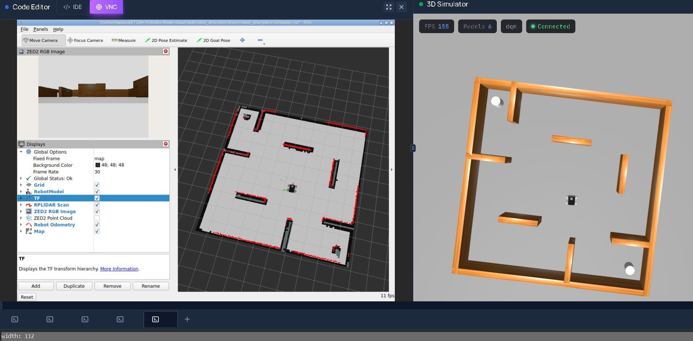
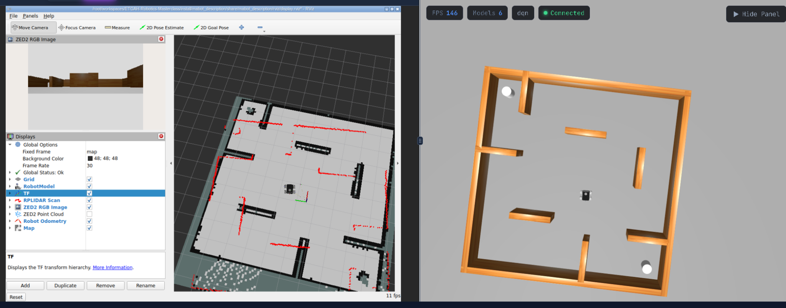
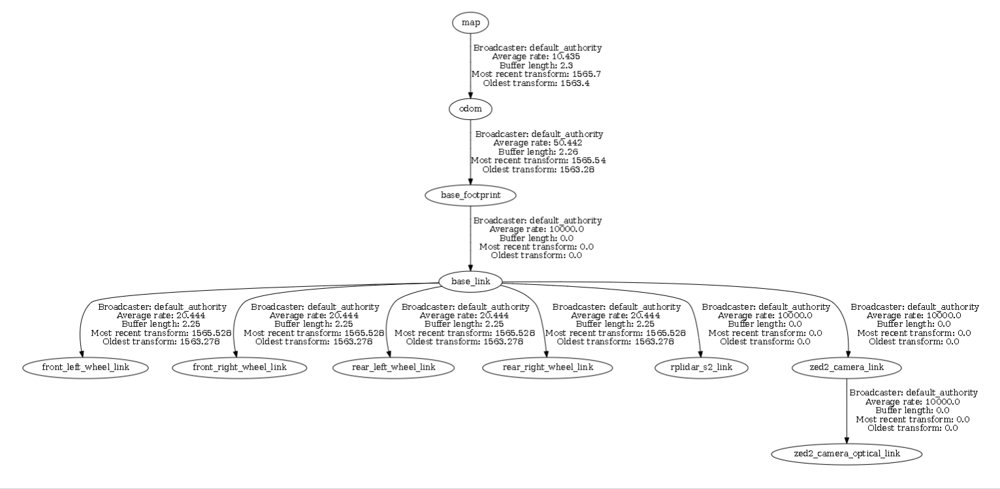

<div align="center">

# MABot
### Mapping & Localization

**A custom robot. Its own world. A map it can navigate within.**

`ROS 2 Jazzy` · `Gazebo Harmonic` · `SLAM Toolbox` · `RPLIDAR S2`

[Results](#results) · [Run the project](#run-the-project) · [Architecture](#architecture) · [Validation](#validation) · [Package guide](#package-guide)



*Live laser scans aligned with the saved environment after a correct 2D Pose Estimate.*

</div>

---

MABot builds a 2D map of its custom Gazebo world using keyboard exploration, saves the occupancy grid and pose graph, then loads the graph in a separate localization session. This package connects that workflow to MABot’s four-wheel platform and simulated LiDAR.

| Explore | Save | Localize |
| :--- | :--- | :--- |
| Drive with keyboard teleop and watch the occupancy grid develop in RViz. | Export the map as YAML/PGM and serialize the graph for reuse. | Load the saved graph and align the live scan using an initial pose estimate. |

Robot design, sensors, simulation, and bridges: [mabot_description](../mabot_description).

## Results

### The mapped world


*Exploration reveals the perimeter, internal walls, and corner obstacles of `mabot_world.sdf`.*

<details>
<summary><strong>View localization before pose correction</strong></summary>



*The live scan is offset from the saved walls in this capture. The opening image shows alignment after the correct manual pose estimate. This capture is labeled by the observed condition; it is not evidence of a deliberately injected wrong pose.*

</details>

## Run the project

**Workflow:** set up → start MABot and RViz → map → save → switch to localization.

Open the steps below for the complete commands. Run mapping and localization separately, keeping the simulation running when switching modes.

<details>
<summary><strong>1. Setup and build</strong></summary>

Use an environment with ROS 2 Jazzy and Gazebo Harmonic configured. Required components include `ros_gz_sim`, `ros_gz_bridge`, `ros_gz_image`, `robot_state_publisher`, `xacro`, `slam_toolbox`, `nav2_map_server`, `rviz2`, `tf2_tools`, and `teleop_twist_keyboard`.

The commands below use the workspace location tested in ETGAH. If obtaining the project for the first time:

```bash
mkdir -p ~/workspaces
cd ~/workspaces
git clone https://github.com/men3m-4/ETGAH-Robotics-Masterclass.git
```

Build the two MABot packages:

```bash
cd ~/workspaces/ETGAH-Robotics-Masterclass
source /opt/ros/jazzy/setup.bash
colcon build --symlink-install \
  --packages-select mabot_description mabot_slam
source install/setup.bash
```

In each additional terminal, run:

```bash
cd ~/workspaces/ETGAH-Robotics-Masterclass
source /opt/ros/jazzy/setup.bash
source install/setup.bash
```

</details>

<details>
<summary><strong>2. Start the MABot simulation</strong></summary>

Terminal 1, inside the ETGAH environment:

```bash
ros2 launch mabot_description gazebo.launch.py
```

This starts the Gazebo server, spawns MABot, starts `robot_state_publisher`, and starts the configured topic and RGB-image bridges. The ETGAH 3D Simulator supplies the graphical view.

For a desktop environment, request the native Gazebo GUI instead:

```bash
ros2 launch mabot_description gazebo.launch.py use_gazebo_gui:=true
```

Choose one simulation launch. If the simulation is already running, keep that instance.

Terminal 2:

```bash
ros2 launch mabot_description display.launch.py
```

This launch starts RViz only. In RViz:

- Set **Global Options → Fixed Frame** to `map` once SLAM starts.
- Enable RobotModel, TF, LaserScan on `/scan`, and Map on `/map`.
- Set the Map display to **Reliable / Transient Local**.
- Set LaserScan **Decay Time** to `0` for the current scan.
- Disable the point cloud and odometry display when checking 2D scan alignment.

The display launch loads `mabot_description/rviz/display.rviz`; adjust these settings if the saved configuration differs.

</details>

<details>
<summary><strong>3. Mapping</strong></summary>

Terminal 3:

```bash
ros2 launch mabot_slam mapping.launch.py
```

The launch includes SLAM Toolbox's `online_async_launch.py` and activates its lifecycle node. Gazebo and the robot publishers must already be running.

Check the inputs and SLAM state in another terminal:

```bash
ros2 lifecycle get /slam_toolbox
ros2 param get /slam_toolbox mode
ros2 topic echo /scan --once --field header
ros2 topic echo /odom --once --field header
ros2 topic echo /map --once --field info \
  --qos-durability transient_local --qos-reliability reliable
```

Expected: `active [3]`, mode `mapping`, scan frame `rplidar_s2_link`, odometry frame `odom`, and an occupancy grid at approximately `0.05 m/cell`.

Terminal 4, keyboard control:

```bash
ros2 run teleop_twist_keyboard teleop_twist_keyboard \
  --ros-args -p speed:=0.10 -p turn:=0.20
```

Use `i` to move forward, `,` to move backward, `j`/`l` to turn, and `k` to stop. Keep keyboard focus in this terminal. Use one motion controller at a time.

Explore slowly, including the corners and areas behind obstacles. Revisit previously observed areas and watch the occupancy grid fill in. Red scan returns should follow the mapped walls. Stop the robot before saving. Avoid resetting Gazebo during an active mapping session.

</details>

<details>
<summary><strong>4. Save the map and pose graph</strong></summary>

Keep mapping running while saving both formats. First preserve any existing files:

```bash
cd ~/workspaces/ETGAH-Robotics-Masterclass
backup_dir="mabot_slam/backups/$(date +%Y%m%d_%H%M%S)"
mkdir -p "$backup_dir"
cp -a mabot_slam/map mabot_slam/posegraph "$backup_dir/"
```

Save the occupancy grid:

```bash
ros2 run nav2_map_server map_saver_cli \
  -f "$PWD/mabot_slam/map/mabot_world_map" \
  --fmt pgm \
  --ros-args -p use_sim_time:=true -p save_map_timeout:=10.0
```

Serialize the graph from the same mapping session:

```bash
ros2 service call /slam_toolbox/serialize_map \
  slam_toolbox/srv/SerializePoseGraph \
  "{filename: '$PWD/mabot_slam/posegraph/mabot_world'}"

ls -lh mabot_slam/map/ mabot_slam/posegraph/
```

Successful output includes `Map saved successfully` and `SerializePoseGraph_Response(result=0)`. The graph prefix has no file extension; both `.posegraph` and `.data` must be present.

</details>

<details>
<summary><strong>5. Localization</strong></summary>

Stop the robot with `k`. Stop **only the mapping launch** with Ctrl+C, leaving Gazebo, its bridges, and RViz running. Start localization in its place:

```bash
ros2 launch mabot_slam localization.launch.py \
  posegraph_file:="$PWD/mabot_slam/posegraph/mabot_world"
```

The explicit source path uses the graph just saved. The launch also supports its default installed graph path. It checks that the configuration and both graph files exist and are nonempty before starting the localization lifecycle node.

Verify:

```bash
ros2 lifecycle get /slam_toolbox
ros2 param get /slam_toolbox mode
ros2 param get /slam_toolbox map_file_name
```

Expected: `active [3]`, mode `localization`, and the selected graph prefix. Run one SLAM mode at a time.

### Initial pose experiment

1. Keep MABot stationary. In RViz select **2D Pose Estimate**.
2. Click a deliberately incorrect location on the map and drag to choose an incorrect heading. Capture the scan-map mismatch and describe what actually happens; the estimator may recover or remain mismatched.
3. Select **2D Pose Estimate** again. Click the robot's actual position relative to mapped landmarks, and drag in its actual heading.
4. Confirm that the red scan returns align with the black obstacle boundaries. Capture the corrected result.

Set the pose in map coordinates, using landmarks and the Gazebo view. Do not substitute an `/odom` position directly for a map position.

### Movement and map stability test

After correcting the estimate, drive slowly and turn in open space. Check that the robot's pose updates and scan alignment remains consistent with the saved walls. Record a short video with RViz, Gazebo, and the control terminal visible.

Capture `/map` metadata before and after the movement:

```bash
ros2 topic echo /map --once --field info \
  --qos-durability transient_local --qos-reliability reliable
```

Compare dimensions, resolution, and origin, and inspect the wall geometry. Unchanged metadata alone does not establish an unchanged grid. If the grid changes, record the observation and investigate before reporting the fixed-map test as passed.

</details>

## Architecture



*The map and odometry frames connect to the robot base, four wheels, LiDAR, and camera optical frame.*

<details>
<summary><strong>Capture TF and odometry evidence</strong></summary>

```bash
cd ~/workspaces/ETGAH-Robotics-Masterclass
mkdir -p mabot_slam/docs
ros2 topic echo /odom --once \
  > mabot_slam/docs/odom_localization_sample.txt
cd mabot_slam/docs
ros2 run tf2_tools view_frames
```

The verified TF chain is `map → odom → base_footprint → base_link`. All four wheel frames, `rplidar_s2_link`, and `zed2_camera_link` connect to the base; `zed2_camera_optical_link` connects to the camera frame.

See the [recorded TF diagram](docs/frames_2026-09-10_10.42.49.pdf) and [full odometry sample](docs/odom_localization_sample.txt).

An excerpt from the recorded odometry message:

```yaml
header:
  stamp:
    sec: 1562
    nanosec: 600000000
  frame_id: odom
child_frame_id: base_footprint
pose:
  pose:
    position:
      x: 0.473160388765345
      y: 0.14006412638164453
      z: 0.0
    orientation:
      x: 0.0
      y: 0.0
      z: 0.9359742964194628
      w: 0.3520683405847385
twist:
  twist:
    linear: {x: 0.0, y: 0.0, z: 0.0}
    angular: {x: 0.0, y: 0.0, z: 0.0}
```

The position is relative to `odom`, and the zero velocity corresponds to the stopped robot at capture time. Zero covariance entries in the simulation sample do not establish perfect measurement accuracy.

</details>

## Validation


| Check | Observed result |
| --- | --- |
| Build of `mabot_description` and `mabot_slam` | Both finished without reported build errors; summary: `2 packages finished [5.97s]` |
| Mapping lifecycle and mode | `active [3]`, `mapping` |
| Sensor input | `/scan` and `/odom` messages received |
| Mapping exploration | Keyboard movement and turning; coherent wall boundaries visible in RViz |
| Occupancy-grid save | `Map saved successfully`; saved grid was 96 × 96 at 0.05 m/cell |
| Graph serialization | `result=0`; both graph files created |
| Localization lifecycle and mode | `active [3]`, `localization` |
| Graph selection | Source prefix `mabot_slam/posegraph/mabot_world` confirmed by parameter query |
| Correct initial pose | Live scan visibly aligned with the saved walls after manual correction |
| TF connectivity | Complete chain and sensor branches visible in the generated diagram |
| Odometry record | Sample saved with correct parent/child frame names |

<details>
<summary><strong>Validation scope and remaining checks</strong></summary>

The build result is an incremental build result; lint or other automated test execution is not established by that output.

At the initial localization check, `/map` reported 112 × 104 cells, compared with 96 × 96 at occupancy-grid save time. The reason for this difference and grid stability during subsequent driving have not yet been verified. A deliberate wrong-pose test also needs an explicitly labeled observation; the pre-correction mismatch alone does not establish how the wrong pose was introduced.

A video demonstrating motion during localization remains to be added.

</details>

## Package guide

| Path | Purpose |
| --- | --- |
| `config/slam_mapping.yaml` | Asynchronous mapping parameters |
| `config/slam_localization.yaml` | Localization parameters |
| `launch/mapping.launch.py` | Launch and activate asynchronous SLAM |
| `launch/localization.launch.py` | Validate and load a saved pose graph; activate localization |
| `map/mabot_world_map.yaml` | Saved occupancy-grid metadata |
| `map/mabot_world_map.pgm` | Saved occupancy-grid image |
| `posegraph/mabot_world.posegraph` | Serialized graph |
| `posegraph/mabot_world.data` | Companion serialized data |
| `docs/` | TF diagrams and odometry records |


---

<div align="center">

**Designed and developed by Mohamed Abdelmoniem**  
[GitHub](https://github.com/men3m-4) · [Robot package](../mabot_description) · [Back to top](#mabot)

</div>
