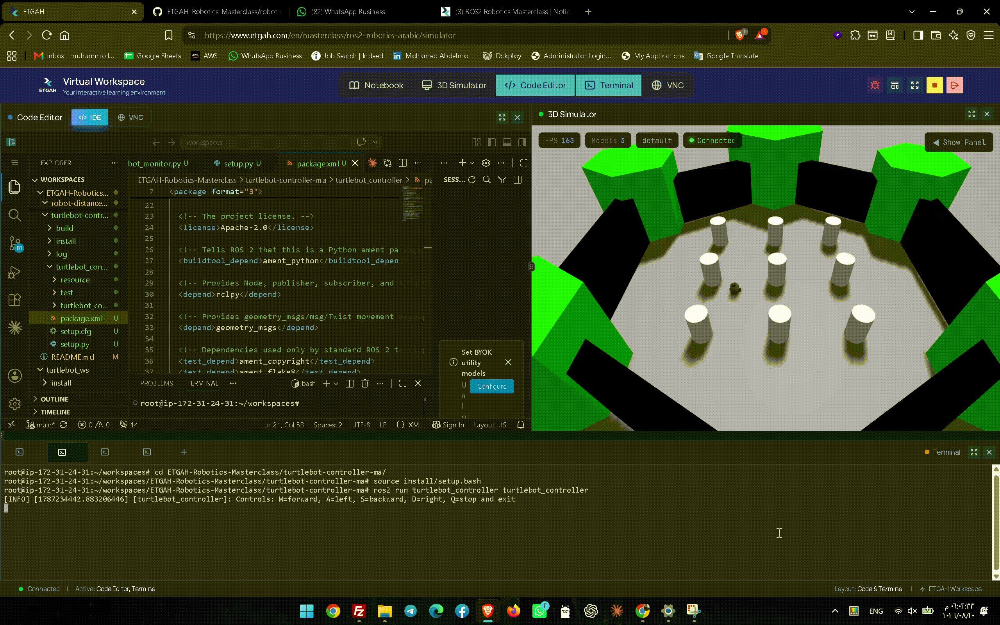

# Make your robot listen and response

## package Description

This is a ROS 2 Python package with two nodes that communicate through the `/cmd_vel` topic using the `geometry_msgs/msg/Twist` message type.

The first node is a publisher that reads keyboard input and sends movement commands to TurtleBot3.  
The second node is a subscriber that listens to the same commands and prints the robot movement values in real time.

```text
Keyboard
   |
   v
turtlebot_controller  --->  /cmd_vel  ---> TurtleBot3 / Gazebo
                                  |
                                  v
                         turtlebot_monitor
```

---

## Nodes

### Publisher Node: `turtlebot_controller.py`

This node acts like a remote control.

It:

- Reads keyboard input.
- Publishes `Twist` messages to `/cmd_vel`.
- Uses `linear.x` for forward and backward movement.
- Uses `angular.z` for left and right turns.
- Re-publishes the latest command at 10 Hz so Gazebo continues receiving movement commands.
- Sends a zero-velocity command and exits when `Q` is pressed.

| Key | `linear.x` | `angular.z` | Robot action |
|---|---:|---:|---|
| `W` | `0.20` | `0.00` | Move forward |
| `S` | `-0.20` | `0.00` | Move backward |
| `A` | `0.00` | `0.80` | Turn left |
| `D` | `0.00` | `-0.80` | Turn right |
| `Q` | `0.00` | `0.00` | Stop robot and exit |

### Subscriber Node: `turtlebot_monitor.py`

This node acts like a dashboard.

It:

- Subscribes to the `/cmd_vel` topic.
- Receives `Twist` messages.
- Reads `msg.linear.x`.
- Reads `msg.angular.z`.
- Prints the received values in a readable format.

Example:

```text
Received command -> linear.x: 0.20 m/s | angular.z: 0.00 rad/s
```

---

## Package Structure

```text
turtlebot-controller-ma/
└── turtlebot_controller/
    ├── package.xml
    ├── setup.py
    ├── setup.cfg
    ├── resource/
    │   └── turtlebot_controller
    ├── test/
    └── turtlebot_controller/
        ├── __init__.py
        ├── turtlebot_controller.py
        └── turtlebot_monitor.py
```

---

## Files Changed or Created

### `turtlebot_controller.py`

The publisher node. It reads W/A/S/D/Q from the keyboard and publishes `Twist` messages to `/cmd_vel`.

### `turtlebot_monitor.py`

The subscriber node. It receives `Twist` messages from `/cmd_vel` and prints `linear.x` and `angular.z`.


```python
'turtlebot_controller = turtlebot_controller.turtlebot_controller:main',
'turtlebot_monitor = turtlebot_controller.turtlebot_monitor:main',
```

Because of these lines, the nodes can run using:

```bash
ros2 run turtlebot_controller turtlebot_controller
ros2 run turtlebot_controller turtlebot_monitor
```

### `package.xml`

This file defines package metadata and required ROS 2 dependencies:

```xml
<depend>rclpy</depend>
<depend>geometry_msgs</depend>
```

- `rclpy`: ROS 2 Python library used to create nodes, publishers, subscribers, and callbacks.
- `geometry_msgs`: provides the `Twist` message type.


---

## Step-by-Step Setup

### Go to the course project directory

```bash
cd ~/workspaces/
```

`cd` means **change directory**.

### Create the project folder

```bash
mkdir turtlebot-controller-ma
```

`mkdir` means **make directory**. This creates the folder for the assignment repository.

```bash
cd turtlebot-controller-ma
```

Moves into the project folder.

### Check the current location

```bash
pwd
```

`pwd` means **print working directory**. It shows the full path of the current folder.

Expected path:

```text
/root/workspaces/ETGAH-Robotics-Masterclass/turtlebot-controller-ma
```

### Create the ROS 2 Python package

```bash
ros2 pkg create turtlebot_controller --build-type ament_python --dependencies rclpy geometry_msgs
```

Explanation:

- `ros2 pkg create`: creates a new ROS 2 package.
- `turtlebot_controller`: package name.
- `--build-type ament_python`: tells ROS 2 this package uses Python.
- `--dependencies rclpy geometry_msgs`: adds the required dependencies.

###  View files and folders

```bash
ls
```

`ls` means **list**. It displays files and folders in the current directory.

```bash
ls turtlebot_controller
```

Shows the ROS 2 package files.


`echo` prints text or environment variable values.

Expected output in this project:

```text
jazzy
```


### Build the package

Run this command from the repository root:

```bash
colcon build 
```

Explanation:

- `colcon build`: builds ROS 2 packages.


Expected output:

```text
Starting >>> turtlebot_controller
Finished <<< turtlebot_controller

Summary: 1 package finished
```

### Source the built workspace

```bash
source install/setup.bash
```

This command allows ROS 2 to find the package that was built.

### Verify the ROS 2 executables

```bash
ros2 pkg executables turtlebot_controller
```

Expected output:

```text
turtlebot_controller turtlebot_controller
turtlebot_controller turtlebot_monitor
```

---

## How to Test the Nodes

### Terminal 1: Run the monitor node

```bash
cd ~/workspaces/turtlebot-controller-ma
source install/setup.bash
ros2 run turtlebot_controller turtlebot_monitor
```

Expected output:

```text
Monitoring /cmd_vel. Waiting for movement commands...
```

### Terminal 2: Run the keyboard controller node

```bash
cd ~/workspaces/turtlebot-controller-ma
source install/setup.bash
ros2 run turtlebot_controller turtlebot_controller
```

Expected output:

```text
Controls: W=forward, A=left, S=backward, D=right, Q=stop and exit
```

Click inside Terminal 2, then press `W`, `A`, `S`, `D`, or `Q`.  
Do not press `Enter`.

### Expected Monitor Output

After pressing `W`:

```text
Received command -> linear.x: 0.20 m/s | angular.z: 0.00 rad/s
```

After pressing `S`:

```text
Received command -> linear.x: -0.20 m/s | angular.z: 0.00 rad/s
```

After pressing `A`:

```text
Received command -> linear.x: 0.00 m/s | angular.z: 0.80 rad/s
```

After pressing `D`:

```text
Received command -> linear.x: 0.00 m/s | angular.z: -0.80 rad/s
```

After pressing `Q`:

```text
Received command -> linear.x: 0.00 m/s | angular.z: 0.00 rad/s
```

The repeated output is normal because the publisher sends the current command 10 times per second.

---

## Review Notes

Full concept review documented on Notion:
[ROS2 Robotics Masterclass — Linux & ROS2 Foundations ](https://app.notion.com/p/Session-2-Linux-ROS2-Foundations-3c2631df44df8078b71ac0705a5a0ea2?source=copy_link)

## Simulation Demo

The following video demonstrates the TurtleBot3 simulation in Gazebo and shows the robot responding to keyboard commands

