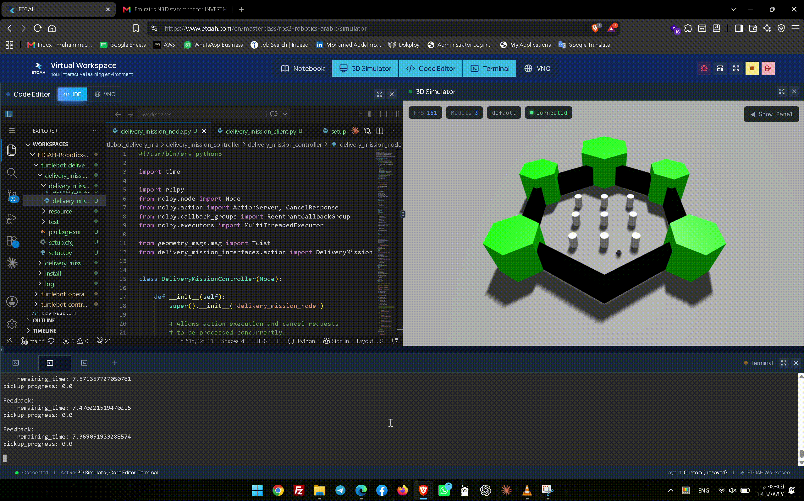

## Overview

The workspace contains two ROS 2 packages:

- `delivery_mission_interfaces` — defines the custom `DeliveryMission.action`
- `delivery_mission_controller` — contains the Action Server and Action Client

The robot executes a complete delivery mission while publishing velocity commands to `/cmd_vel`, streaming feedback, handling timeout conditions, and supporting manual cancellation.

## Mission Flow

1. **Phase 1 — Drive to Pickup Location**  
   The robot moves forward for `pickup_duration`.

2. **Phase 2 — Simulated Package Pickup**  
   The robot stops and reports `pickup_progress` while the pickup is simulated.

3. **Phase 3 — Drive to Delivery Location**  
   The robot moves forward for `delivery_duration`.

## Action Interface

`delivery_mission_interfaces/action/DeliveryMission.action`

```text
float32 speed
float32 pickup_duration
float32 delivery_duration
float32 timeout
---
bool success
string message
---
float32 remaining_time
float32 pickup_progress
```

## ROS 2 Interfaces

| Interface | Name | Type |
|---|---|---|
| Action | `/delivery_mission` | `delivery_mission_interfaces/action/DeliveryMission` |
| Topic | `/cmd_vel` | `geometry_msgs/msg/Twist` |

## Build

```bash
cd ~/workspaces/ETGAH-Robotics-Masterclass/turtlebot_delivery_ma
colcon build
source install/setup.bash
```

## Run the Action Server

```bash
ros2 run delivery_mission_controller delivery_mission_node
```

## Send a Goal from the ROS 2 CLI

```bash
ros2 action send_goal /delivery_mission delivery_mission_interfaces/action/DeliveryMission "{speed: 0.2, pickup_duration: 5.0, delivery_duration: 8.0, timeout: 20.0}" --feedback
```

A successful mission returns:

```text
success: true
message: Delivery mission completed successfully
Goal finished with status: SUCCEEDED
```

## Run the Action Client

```bash
ros2 run delivery_mission_controller delivery_mission_client
```

The client:

- Sends the delivery goal
- Displays `remaining_time` and `pickup_progress`
- Receives the final result
- Allows the operator to cancel the active mission manually

Press:

```text
c
```

to cancel the mission.

Example cancel result:

```text
Cancel request ACCEPTED
Result success: False
Result message: Mission canceled by operator
Goal status: CANCELED
```

## Timeout Handling

The timeout applies to the complete mission.

If the total execution time exceeds the requested timeout, the robot stops immediately and the Action Server aborts the goal.

Example:

```text
success: false
message: Mission aborted: timeout exceeded during Phase 3
Goal finished with status: ABORTED
```


## Simulation Demo

The following video demonstrates the TurtleBot3 simulation in Gazebo and shows the robot responding to keyboard commands

